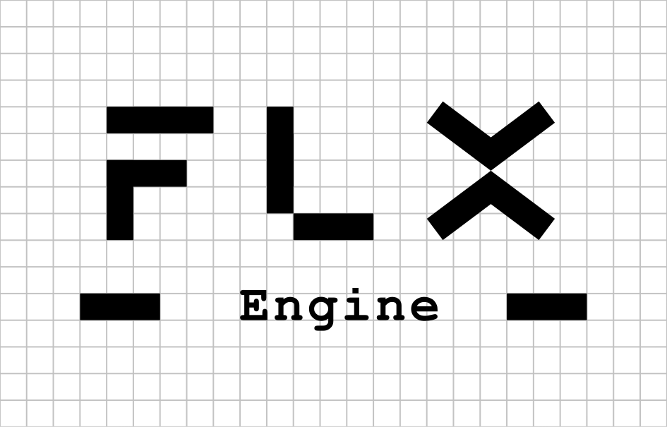

# FLX Engine

> Lightweight 2D game development, forged around simplicity and direct creation.



FLX Engine is a lightweight 2D game engine focused on clear architecture, direct workflows and minimal friction.

The project is designed for developers who want to build games without depending on oversized editors, proprietary pipelines or unnecessarily complex architectures.

---

## Philosophy

FLX focuses on:

- Lightweight workflows
- Clear architecture
- Fast iteration
- Direct control
- Standard technologies
- Minimal overhead

The goal is simple:

> Build games without fighting the engine.

FLX is especially suited for:

- 2D games
- Arcade projects
- Prototypes
- Visual novels
- Experimental ideas
- Small and medium-sized productions

---

## Minimal Example

```json
{
  "$schema": "https://flxforge.github.io/FLXEngine/schemas/object.schema.json",

  "origin": {
    "x": 320,
    "y": 160
  },

  "shape": {
    "type": "triangle",
    "color": "WHITE",
    "size": {
      "width": 18,
      "height": 24
    }
  }
}
```

```js
/// <reference path="https://flxforge.github.io/FLXEngine/scripts/flx.d.ts" />

function motion(ship) {
    advance(ship);
}
```

FLX keeps game structure simple, readable and easy to modify.

JSON files describe FLX objects. Objects gain capabilities from the
properties they declare: `shape` makes them drawable, `collision` makes
them collide, `behavior` attaches scripts and `children` declares what
can exist below them.

Objects can also declare local sounds:

```json
{
  "sounds": {
    "beep": {
      "wave": "square",
      "frequency": 880,
      "duration": 0.08,
      "volume": 0.7
    }
  }
}
```

Scripts can play declared sounds and trigger screen fades:

```js
play_sound(ship, "beep");

fade_on();
fade_off("#000000");
```

---

## Built Around Standards

FLX avoids unnecessary proprietary systems.

Projects are built using familiar technologies:

- JSON for project and scene data
- JavaScript for gameplay scripting
- Standard asset formats
- No mandatory custom editor
- No proprietary scripting language

You can work using your preferred tools and workflows.

---

## The `.flx` Project File

Every FLX project starts with a single entry point:

```text
MyGame.flx
```

This file defines project metadata, runtime configuration, the root object and,
optionally, the Machine YAML used by the project.

```text
machine=machines/standard.yml
```

If no Machine is declared, FLX uses an internal default Machine compatible with
the current runtime behavior.

---

## Current Status

FLX Engine is currently under active development.

The project is evolving progressively with a strong focus on maintaining architectural clarity and simplicity from the very beginning.

Some systems may evolve during the early 0.x versions.

---

## FLX Forge

FLX Engine is part of the broader **FLX Forge** initiative.

The idea behind Forge is simple:
create lightweight and understandable tools focused on direct game creation.

Additional tooling may appear progressively as the project evolves.

---

## Why FLX?

Because small projects deserve solid tools too.
