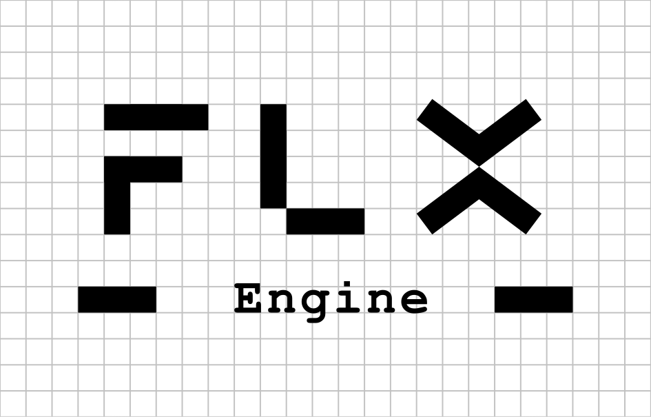

# FLX Engine

> Lightweight 2D game development through declarative worlds and direct behavior.



FLX Engine is a lightweight 2D game engine built around a simple idea:

**declare the world, then describe how it behaves.**

Objects, visuals, mechanics, collisions, audio and relationships are declared as data.  
JavaScript provides behavior.  
Machines define the capabilities and constraints of the environment where the world runs.

FLX is designed to keep those pieces visible, understandable and directly editable, without requiring a proprietary editor or workflow.

<br clear="left"/>

---

## See FLX in action

<p align="center">
  
</p>

FLX is being developed by building real games with it. Pong, Asteroids, Arkanoid, Invaders and Tank have been used to shape and validate the engine's current foundation.

---

## A FLX object

A world is built from declarative objects:

```json
{
  "$schema": "https://flxforge.github.io/FLXEngine/schemas/object.schema.json",

  "origin": {
    "x": 320,
    "y": 160
  },

  "size": {
    "width": 18,
    "height": 24
  },

  "visual": {
    "color": "white",
    "representation": [
      { "primitive": "triangle" }
    ]
  },

  "mechanics": {
    "type": "polar",
    "motion": {
      "speed": 120
    }
  }
}
```

Behavior stays explicit:

```js
/// <reference path="https://flxforge.github.io/FLXEngine/scripts/flx.d.ts" />

function motion(ship) {
    advance(ship);
}
```

The declaration describes **what the object is and what capabilities it has**.  
The script describes **what it does**.

That separation is at the core of FLX.

---

## Why FLX?

FLX is built around a few principles:

- **Declarative first** — game objects and their capabilities are expressed as readable data.
- **Behavior stays behavior** — JavaScript focuses on what happens rather than reconstructing the world.
- **No mandatory editor** — FLX projects remain understandable and editable as files.
- **Standard technologies** — JSON, JavaScript, YAML and conventional asset formats.
- **Small pieces that compose** — capabilities are combined instead of requiring large predefined object types.
- **The engine grows from games** — new features are introduced when real games reveal a limitation.

The goal is not to anticipate every feature a game engine could have.

The goal is to keep the things FLX does **coherent, direct and understandable**.

---

## Projects

Every FLX project starts from a `.flx` manifest:

```text
MyGame.flx
```

It connects the project's root object with the environment needed to run it:

```text
name=My Game
root=game.json
machine=machines/standard.yml
input.mapping=input/default.input
```

From there, JSON declarations build the world and JavaScript gives it behavior.

FLX can be used directly from the command line:

```text
flx MyGame.flx
```

or explicitly:

```text
flx run MyGame.flx
```

No project editor is required.

---

## Machines

A FLX world does not need to assume that every machine has the same capabilities.

Machines describe the environment in which the world runs: video, audio and input capabilities can be declared independently from the game itself.

This makes Machine part of the model rather than a collection of hidden engine assumptions, and provides a foundation for exploring different generations and styles of 2D systems.

---

## Examples

FLX v0.3.0 includes five games used during the development and audit of the current engine foundation:

**Pong** — fundamental objects, movement, input and collision.  
**Asteroids** — oriented movement, lifecycle and dynamic objects.  
**Arkanoid** — rule composition, levels and temporary modifications.  
**Invaders** — coordinated structures and groups of objects.  
**Tank** — perception and autonomous behavior.

They are examples, but also tests of the engine's design: FLX evolves when building a game exposes a limitation that cannot reasonably be solved by combining existing capabilities.

---

## Documentation

The public documentation covers the complete FLX v0.3.0 contract:

- Getting Started
- Mental model and philosophy
- JSON Reference
- JavaScript API
- Machines
- CLI
- Diagnostics
- Examples
- Roadmap

**Spanish is the canonical documentation.**  
The English documentation mirrors it semantically and structurally.

### Documentation

- [Español](https://flxforge.github.io/FLXEngine/es/)
- [English](https://flxforge.github.io/FLXEngine/en/)

---

## Built around standards

FLX avoids unnecessary proprietary formats and systems.

A project is made from files that can be inspected, versioned and edited with normal development tools:

```text
.flx       project manifest
.json      world and object declarations
.js        behavior
.yml       Machine definitions
.input     input mappings
```

You can use the editor, IDE, version-control system and asset tools you prefer.

---

## Current status

**FLX Engine v0.3.0** establishes the first consolidated foundation of the engine.

This version defines the common model for object declaration and composition, creation, visuals, mechanics, input, collisions, lifecycle, object relationships, audio, Machines, scripting, CLI and diagnostics.

FLX remains an evolving personal project. Future capabilities will continue to emerge from building games with the engine rather than from trying to predict every feature in advance.

See the [Roadmap](https://flxforge.github.io/FLXEngine/en/roadmap.html) for the current directions of exploration.

---

## FLX Forge

FLX Engine is part of **FLX Forge**: a space for building lightweight, understandable tools around direct game creation.

The engine is the foundation. Other tools can grow around it without becoming requirements for using FLX.

---

## Why FLX?

Because making a small game should not require fighting a large engine.
