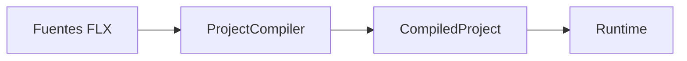

# Especificación de E-Merge FLX

## Propósito

Este directorio contiene la especificación normativa de E-Merge FLX.

Su objetivo es definir:

- qué es FLX;
- qué entradas acepta;
- qué resultados produce;
- cómo deben comportarse sus componentes;
- qué contratos existen entre sus distintas partes;
- qué errores y diagnósticos deben generarse;
- qué comportamiento debe mantenerse aunque cambie la implementación.

La especificación es independiente del lenguaje de programación, las librerías y la arquitectura concreta utilizadas para implementar FLX.

Si la implementación actual desapareciera o fuera sustituida, estos documentos deberían permitir reconstruir el comportamiento esencial de E-Merge FLX.

---

## Autoridad

La especificación describe el comportamiento esperado del sistema.

La implementación debe ajustarse a ella.

Cuando exista una discrepancia entre:

- la especificación;
- la documentación técnica;
- la implementación;
- los tests;

la discrepancia debe investigarse.

No debe asumirse automáticamente que el código actual representa el comportamiento correcto.

El proceso esperado es:

```text
especificación
→ tests
→ implementación
```

Los tests verifican el contrato definido por la especificación.

La implementación puede cambiar mientras conserve dicho contrato.

---

## Lenguaje normativo

Los documentos utilizan los siguientes términos:

- **DEBE**: requisito obligatorio.
- **NO DEBE**: comportamiento prohibido.
- **DEBERÍA**: comportamiento recomendado, salvo excepción justificada.
- **NO DEBERÍA**: comportamiento desaconsejado.
- **PUEDE**: comportamiento permitido u opcional.

Las explicaciones, ejemplos y diagramas ayudan a entender el contrato, pero no sustituyen las reglas normativas.

---

## Organización

Las especificaciones se organizan por responsabilidad.

Estructura prevista:

```text
spec/
  README.md
  cli.md
  diagnostics.md
  compiler.md
  compiled-project.md
  resources.md
  references.md
  runtime.md
  lifecycle.md
  project-manifest.md
  machine.md
  video-chip.md
  audio-chip.md
  input-chip.md
  javascript-api.md
  exit-codes.md
```

No todos los documentos tienen que existir desde el principio.

Cada documento se crea cuando la responsabilidad correspondiente se audita y consolida.

---

## Documentos actuales

### [CLI](cli.md)

Define:

- identidad del ejecutable `flx`;
- sintaxis general;
- comandos;
- opciones;
- resolución de proyectos;
- ayuda;
- versión;
- formatos de salida;
- códigos de salida;
- comportamiento esperado para automatizaciones.

---

## Diagramas

Los diagramas se incluyen dentro del documento al que pertenecen.

Por ejemplo:

- el flujo de comandos se documenta en `cli.md`;
- el flujo de compilación se documenta en `compiler.md`;
- el ciclo de vida de los objetos se documenta en `lifecycle.md`;
- la composición de Machine y Chips se documenta en `machine.md`.

Se utiliza preferentemente Mermaid dentro de Markdown.

Ejemplo:



Los diagramas deben representar:

- flujos;
- dependencias;
- secuencias;
- estados;
- fronteras;
- estructuras conceptuales.

El texto normativo conserva siempre la autoridad principal.

Si un diagrama y el texto se contradicen, prevalece el texto.

---

## Diagramas independientes

Puede existir un documento específico de diagramas cuando estos tengan valor propio como visión global.

Ejemplos posibles:

```text
architecture-diagrams.md
runtime-diagrams.md
compiler-diagrams.md
```

Esto solo debe hacerse cuando:

- el diagrama sea suficientemente explicativo por sí mismo;
- reúna varias especificaciones sin duplicarlas;
- ofrezca una vista transversal útil;
- no obligue a separar un diagrama del texto necesario para entenderlo.

Un archivo de diagramas no debe convertirse en un almacén desordenado de gráficos.

---

## Relación con otras documentaciones

La especificación no sustituye al resto de documentos del proyecto.

### Documentación de visión y arquitectura

Explica:

- por qué existe FLX;
- su filosofía;
- sus objetivos;
- las decisiones de diseño;
- su evolución prevista.

### Especificación

Define:

- qué acepta FLX;
- qué produce;
- cómo debe comportarse;
- qué contratos son obligatorios.

### Documentación técnica de implementación

Explica:

- cómo está implementada una versión concreta;
- qué clases existen;
- qué dependencias utiliza;
- cómo se organiza el código C++.

### Documentación pública

Explica a las personas usuarias:

- cómo instalar FLX;
- cómo crear proyectos;
- cómo usar JSON y JavaScript;
- cómo ejecutar y distribuir juegos.

Estas capas pueden compartir conceptos, pero no deben mezclarse de forma que una decisión normativa dependa de un detalle accidental de implementación.

---

## Relación con los tests

Toda regla pública importante debería estar respaldada por una prueba automatizada.

Ejemplo:

```text
CLI-VERSION-001
flx --version DEBE imprimir únicamente la versión semántica y finalizar con código 0.
```

La prueba correspondiente debe comprobar:

- contenido exacto de `stdout`;
- ausencia de contenido inesperado en `stderr`;
- código de salida.

Los tests deben organizarse por responsabilidad.

La estructura actual incluye suites diferenciadas para:

- CLI;
- Compiler;
- proyecto compilado;
- Runtime;
- ejemplos;
- soporte común.

Los nombres de los tests deben permitir identificar claramente qué contrato ha fallado.

---

## Proceso de cambio

Cuando cambie un comportamiento especificado, deben revisarse conjuntamente:

1. la especificación;
2. los diagramas relacionados;
3. los tests;
4. la implementación;
5. la documentación pública afectada.

No debe modificarse la implementación pública sin revisar primero el contrato correspondiente.

---

## Compatibilidad

Las reglas de compatibilidad se definirán explícitamente cuando FLX alcance una etapa en la que deba conservar contratos públicos entre versiones.

Mientras el proyecto no tenga usuarios externos o productos dependientes, una especificación puede cambiar deliberadamente si la nueva decisión mejora la coherencia del sistema.

Los cambios no deben mantenerse por compatibilidad histórica si generan deuda técnica innecesaria.

---

## Principios de la especificación

### Una responsabilidad por documento

Cada documento debe responder a una pregunta concreta.

Ejemplos:

```text
cli.md
¿Cómo se utiliza la herramienta flx?

compiler.md
¿Cómo se transforma un proyecto fuente en CompiledProject?

runtime.md
¿Cómo se ejecuta un CompiledProject?

lifecycle.md
¿Cómo nace, vive y muere un objeto?
```

### Texto antes que implementación

La especificación no debe fijar:

- tipos concretos de C++;
- contenedores;
- punteros;
- nombres privados;
- librerías;
- algoritmos internos;

salvo cuando formen parte del contrato externo.

### Complejidad emergente

No deben documentarse capacidades futuras como si ya existieran.

Una nueva regla debe incorporarse cuando:

- exista una necesidad real;
- represente una responsabilidad clara;
- haya sido consolidada;
- pueda verificarse.

### Diagramas simples

Un diagrama debe responder a una pregunta concreta.

Es preferible disponer de varios diagramas pequeños y claros que de uno único que mezcle:

- ecosistema;
- clases;
- estados;
- secuencias;
- implementación;
- roadmap.

---

## Estado

Esta especificación está en construcción.

Cada documento debe indicar, cuando sea relevante:

- estado;
- versión desde la que aplica;
- partes consolidadas;
- partes pendientes;
- reglas todavía no consideradas estables.
