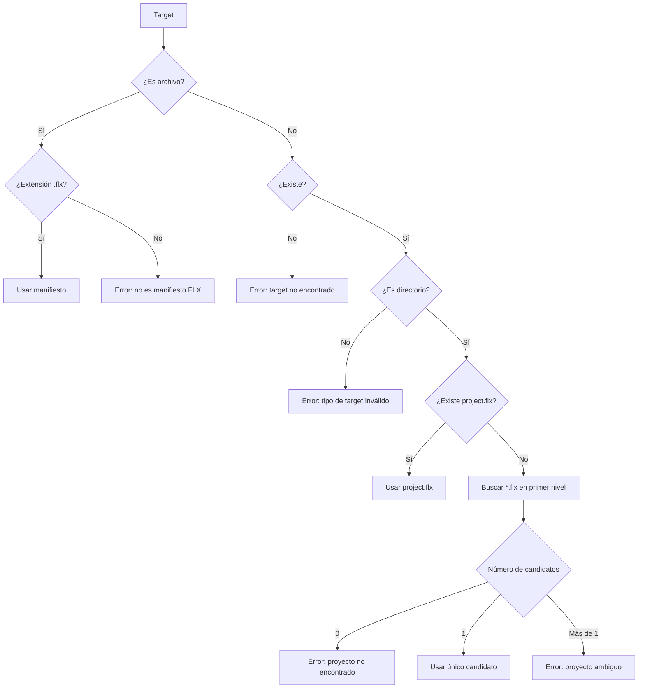
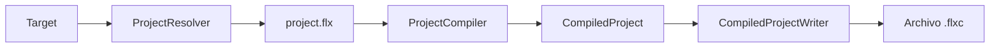
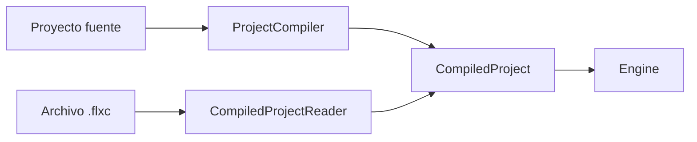
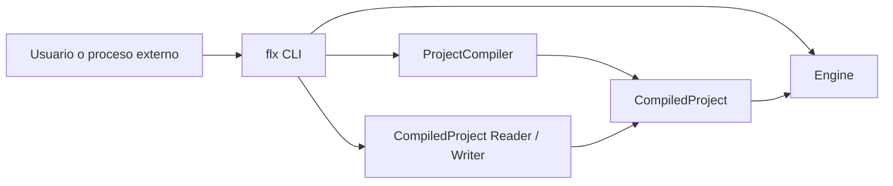
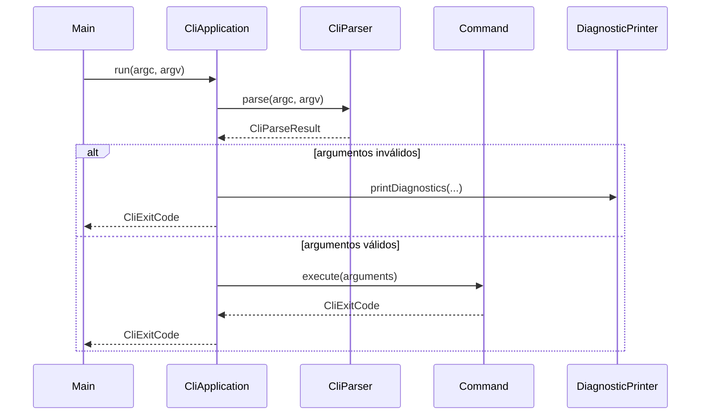

# FLX CLI Specification

## 1. Propósito

`flx` es la interfaz de línea de comandos de E-Merge FLX.

Su responsabilidad es ofrecer una entrada única y estable para:

* ejecutar proyectos FLX;
* validar proyectos;
* compilar proyectos;
* ejecutar proyectos compilados;
* construir productos distribuibles;
* consultar información de la herramienta;
* facilitar la integración con Tools, Hubs, automatizaciones y sistemas externos.

El CLI no define el contenido del juego.

El CLI controla una ejecución concreta de las herramientas FLX.

---

## 2. Identidad

El ejecutable DEBE llamarse:

```text
flx.exe
```

La forma habitual de invocarlo DEBE ser:

```text
flx
```

La instalación recomendada en Windows será:

```text
C:\Program Files\E-Merge FLX\bin\flx.exe
```

El directorio:

```text
C:\Program Files\E-Merge FLX\bin
```

DEBERÍA añadirse a la variable de entorno `PATH` para permitir la ejecución de `flx` desde cualquier directorio.

---

## 3. Sintaxis general

La sintaxis general del CLI es:

```text
flx [command] [options...] [target]
```

Donde:

* `command` indica la operación que debe realizarse;
* `options` modifica únicamente esa ejecución del CLI;
* `target` identifica el proyecto, directorio o recurso sobre el que opera el comando.

La forma canónica documentada será:

```text
flx command options target
```

Ejemplo:

```text
flx run --frames=120 .
```

El parser PUEDE aceptar opciones en otro orden cuando no exista ambigüedad, pero la documentación utilizará siempre una única forma.

---

## 4. Comando predeterminado

El comando predeterminado es:

```text
run
```

Por tanto:

```text
flx .
```

equivale a:

```text
flx run .
```

Y:

```text
flx project.flx
```

equivale a:

```text
flx run project.flx
```

---

## 5. Destino predeterminado

El destino predeterminado es el directorio actual:

```text
.
```

Por tanto:

```text
flx
```

equivale a:

```text
flx run .
```

---

## 6. Resolución de proyectos

Cuando un comando necesite un proyecto, el destino podrá ser:

* un archivo `.flx`;
* un directorio;
* el directorio actual mediante `.`.



### 6.1 Destino `.flx`

Si el destino identifica un archivo con extensión `.flx`, el CLI DEBE utilizar ese archivo como manifiesto del proyecto.

Ejemplo:

```text
flx run examples/pong.flx
```

### 6.2 Destino directorio

Si el destino identifica un directorio, el CLI DEBE buscar el manifiesto siguiendo este orden:

1. Si existe `project.flx`, DEBE utilizarse.
2. Si no existe `project.flx`, pero existe exactamente un archivo `*.flx`, DEBE utilizarse.
3. Si no existe ningún archivo `.flx`, el comando DEBE fallar indicando que no se ha encontrado un proyecto.
4. Si existen varios archivos `.flx`, el comando DEBE fallar por ambigüedad y mostrar los candidatos.

El CLI NO DEBE elegir arbitrariamente el primer archivo encontrado.

### 6.3 Proyecto no encontrado

Cuando no pueda resolverse un proyecto, el CLI DEBE:

* finalizar con un código de error documentado;
* indicar el destino utilizado;
* explicar por qué no se ha encontrado o por qué resulta ambiguo;
* sugerir `flx --help` cuando corresponda.

---

## 7. Comandos iniciales

### 7.1 `run`

Compila temporalmente el proyecto desde sus fuentes y lo ejecuta.

```text
flx run [options...] [target]
```

Ejemplos:

```text
flx run .
flx run project.flx
flx run --frames=120 .
```

El comando DEBE usar:

```text
ProjectCompiler
→ CompiledProject
→ Engine
```

No debe existir un camino alternativo que ejecute directamente desde JSON.

El proceso CLI crea un único host `Engine` por ejecución. Ese host recibe
`CompiledProject` y opciones de ejecución, devuelve un resultado de motor
estructurado y no se reutiliza para ejecutar otro proyecto dentro del mismo
proceso CLI.


---

### 7.2 `compile`

Compila el proyecto y genera una representación compilada autónoma `.flxc`.

```text
flx compile [options...] [target]
```

Ejemplo:

```text
flx compile --output=game.flxc .
```

El resultado NO es todavía un producto final distribuible.

El comando `compile` produce un proyecto compilado.

El comando `build` producirá un producto distribuible.




---

### 7.3 `run-compiled`

Ejecuta un proyecto compilado `.flxc`.

```text
flx run-compiled [options...] target.flxc
```

Ejemplo:

```text
flx run-compiled --frames=120 game.flxc
```

El runtime NO DEBE necesitar:

* `project.flx`;
* JSON;
* YAML;
* JavaScript externo;
* recursos fuente ya embebidos en el proyecto compilado.


---

### 7.4 `validate`

Valida un proyecto sin ejecutarlo ni generar un producto compilado.

```text
flx validate [options...] [target]
```

Debe comprobar, según las capacidades existentes:

* manifiesto;
* Machine;
* Chips;
* recursos JSON;
* referencias;
* `like`;
* grafo de recursos;
* scripts;
* campos;
* tipos;
* rangos;
* compatibilidad del proyecto.

Un proyecto válido DEBE finalizar con código `0`.

Un proyecto inválido DEBE finalizar con el código correspondiente a validación o compilación fallida.

---

### 7.5 `build` reservado futuro

`build` es un comando reservado para una fase futura.

```text
flx build [options...] [target]
```

No debe aparecer en la ayuda actual como comando disponible y no debe aceptarse
como comando operativo hasta que exista el Builder completo.

Conceptualmente:

```text
compile
→ produce CompiledProject

build
→ produce ejecutable y recursos distribuibles
```

`build` NO DEBE ser un alias de `compile`.

---

### 7.6 `version`

Muestra la versión del CLI.

Formas aceptadas:

```text
flx version
flx --version
flx -v
```

La forma canónica recomendada es:

```text
flx --version
```

La salida estándar DEBE contener únicamente la versión semántica:

```text
0.3.0
```

No debe incluir:

* prefijos;
* mensajes del Logger;
* nombre del producto;
* texto decorativo.

El comando DEBE finalizar con código `0`.

No debe inicializar:

* ProjectCompiler;
* runtime;
* ventana;
* audio;
* Machine;
* recursos del proyecto.

---

### 7.7 `help`

Muestra ayuda del CLI.

Formas aceptadas:

```text
flx help
flx --help
flx -h
```

La forma canónica recomendada es:

```text
flx --help
```

La salida DEBE incluir:

* sintaxis general;
* comandos disponibles;
* descripción breve de cada comando;
* opciones globales;
* ejemplos básicos;
* forma de consultar ayuda específica de un comando.

Ejemplo conceptual:

```text
Usage:
  flx [command] [options] [target]

Commands:
  run             Compile and run a project
  compile         Generate a compiled FLX project
  run-compiled    Run a compiled FLX project
  validate        Validate a project
  version         Show FLX version
  help            Show help

Options:
  --help, -h
  --version, -v
  --frames=<number>              Only for run and run-compiled
  --window-mode=<window|fullscreen>
                                 Only for run and run-compiled
  --scale=<number>               Only for run and run-compiled
  --debug-logs[=<true|false>]    Only for run and run-compiled
  --debug-console[=<true|false>] Only for run and run-compiled
  --debug-collisions[=<true|false>]
                                 Only for run and run-compiled
  --output=<path>                Only for compile
  --format=<text|json>           Only for compile and validate
```

El comando DEBE finalizar con código `0`.

### 7.7.1 Ayuda por comando

El CLI DEBERÍA permitir:

```text
flx help run
flx run --help
flx help compile
```

La ayuda específica DEBE mostrar únicamente las opciones y argumentos válidos para ese comando.

---

## 8. Comandos no válidos

Si el usuario escribe un comando desconocido:

```text
flx bulid
```

el CLI DEBE mostrar un mensaje claro:

```text
Unknown command: bulid
Run 'flx --help' for usage information.
```

El CLI DEBE finalizar con el código correspondiente a uso inválido.

Cuando un argumento pueda ser tanto un comando desconocido como una ruta de proyecto, se aplicará esta regla:

* si identifica una ruta existente, se tratará como destino del comando `run`;
* si termina en `.flx`, se tratará como destino del comando `run`;
* en otro caso, se tratará como comando desconocido.

---

## 9. Opciones

Las opciones describen una ejecución concreta del CLI.

No forman parte de la definición del proyecto.

### 9.1 Forma general

Las opciones largas utilizan:

```text
--name
--name=value
```

Cuando una opción booleana se declara sin valor:

```text
--verbose
```

equivale a:

```text
--verbose=true
```

Las opciones cortas, cuando existan, deben ser alias de una opción larga.

Ejemplo:

```text
-v
```

equivale a:

```text
--version
```

---

### 9.2 `--frames`

Limita la cantidad de frames que se ejecutarán.

```text
--frames=<positive-integer>
```

Ejemplos:

```text
flx run --frames=10 .
flx run-compiled --frames=10 game.flxc
```

Su finalidad principal es:

* smoke tests;
* automatización;
* integración continua;
* diagnóstico.

No forma parte del proyecto.

Valores inválidos:

* texto no numérico;
* cero;
* números negativos;
* valores fuera del rango soportado.

Un valor inválido DEBE producir un diagnóstico de argumentos y NO DEBE lanzar una excepción no controlada.

---

### 9.3 Opciones de ejecucion

Estas opciones solo son validas para:

```text
run
run-compiled
```

Ambos comandos aceptan el mismo conjunto de opciones de ejecucion.

No son validas para:

```text
compile
validate
help
version
```

#### 9.3.1 `--window-mode`

Selecciona el modo de ventana para esta ejecucion.

```text
--window-mode=window
--window-mode=fullscreen
```

Valor predeterminado:

```text
window
```

Valores validos:

* `window`;
* `fullscreen`.

No se implementa todavia ningun modo `embedded`.

#### 9.3.2 `--scale`

Sobrescribe la escala de salida de la Machine solo durante esta ejecucion.

```text
--scale=<positive-integer>
```

El valor debe ser mayor que cero.

Esta opcion no modifica:

* `project.flx`;
* la Machine compilada;
* el contenido de `.flxc`.

#### 9.3.3 `--debug-logs`

Controla los logs internos de depuracion durante esta ejecucion.

```text
--debug-logs
--debug-logs=true
--debug-logs=false
```

Valor predeterminado:

```text
false
```

Cuando se omite el valor, equivale a `true`.

#### 9.3.4 `--debug-console`

Controla la salida de logs por consola durante esta ejecucion.

```text
--debug-console
--debug-console=true
--debug-console=false
```

Valor predeterminado:

```text
false
```

No debe confundirse con `--debug-logs`: una opcion controla si se generan logs
de depuracion y la otra si el runtime los escribe por consola.

#### 9.3.5 `--debug-collisions`

Activa el dibujado de colisiones de depuracion durante esta ejecucion.

```text
--debug-collisions
--debug-collisions=true
--debug-collisions=false
```

Valor predeterminado:

```text
false
```

Cuando se omite el valor, equivale a `true`.

### 9.4 Precedencia de opciones de ejecucion

La Machine define:

* resolucion logica;
* escala de salida por defecto;
* smoothing y capacidades de salida.

Las opciones del CLI describen una ejecucion concreta y tienen precedencia
sobre los valores efectivos por defecto cuando corresponda.

Reglas:

* `--scale` sobrescribe `machine.video.output.scale` solo durante la ejecucion.
* `--window-mode` no modifica la Machine ni el manifiesto.
* `--debug-*` no modifica la Machine ni el manifiesto.
* Las opciones de ejecucion no se serializan en `.flxc`.
* `run` y `run-compiled` reciben las mismas opciones de ejecucion.

---

### 9.5 `--output`

Indica la salida de un comando que genera archivos.

```text
--output=<path>
```

Ejemplo:

```text
flx compile --output=game.flxc .
```

Alias opcional:

```text
-o game.flxc
```

La forma canónica será `--output`.

La opción solo será válida en comandos que produzcan una salida.

---

### 9.6 `--format`

Selecciona el formato de salida del CLI.

```text
--format=text
--format=json
```

El valor predeterminado es:

```text
text
```

`json` está orientado a:

* Tools;
* Hubs;
* automatizaciones;
* integración continua;
* otras aplicaciones.

---

## 10. Debug

Las opciones de depuracion de una ejecucion pertenecen al CLI, no al manifiesto del proyecto.

Opciones iniciales:

```text
--debug-logs[=<true|false>]
--debug-console[=<true|false>]
--debug-collisions[=<true|false>]
```

El archivo `.flx` NO DEBE contener opciones destinadas unicamente a una
ejecucion de depuracion.

La configuracion de depuracion NO DEBE incorporarse accidentalmente al producto
final generado por `build` ni persistirse dentro de `.flxc`.

---

## 11. Salidas

El CLI distingue entre:

* salida estándar (`stdout`);
* salida de error (`stderr`);
* código de salida del proceso.

### 11.1 `stdout`

Debe utilizarse para:

* resultados solicitados;
* versión;
* ayuda;
* información estructurada;
* rutas de productos generados;
* salida JSON.

### 11.2 `stderr`

Debe utilizarse para:

* errores;
* warnings;
* diagnósticos humanos;
* mensajes que no forman parte del resultado estructurado solicitado.

### 11.3 Salida JSON

Cuando se utilice:

```text
--format=json
```

el CLI DEBE producir una estructura estable y apta para ser procesada por herramientas.

Ejemplo conceptual:

```json
{
  "success": false,
  "command": "validate",
  "exitCode": 4,
  "diagnostics": [
    {
      "severity": "error",
      "code": "FLX-RESOURCE-00010",
      "identifier": "MissingReferencedResource",
      "file": "objects/player.json",
      "field": "children.laser",
      "message": "Referenced resource was not found."
    }
  ]
}
```

Los mensajes humanos NO DEBEN mezclarse con la salida JSON en `stdout`.

Cada diagnostico JSON DEBE incluir:

* `severity`;
* `code` con formato `FLX-DOMAIN-NNNNN`;
* `identifier`;
* `file` como cadena, vacia si no aplica;
* `field` como cadena, vacia si no aplica;
* `message`.

El campo `range` DEBE aparecer solo cuando exista una posicion concreta.

---

## 12. Diagnósticos

Todo diagnóstico podrá contener:

* severidad;
* código estable;
* archivo;
* campo;
* mensaje.

Severidades:

```text
info
warning
error
```

Los códigos de diagnóstico deben ser estables y documentados cuando formen parte de integraciones externas.

Ejemplo:

```text
FLX-CLI-00002
FLX-PROJECT-00010
FLX-RESOURCE-00010
FLX-BINARY-00001
```

El texto del mensaje puede mejorar entre versiones.

El código del diagnóstico no debería cambiar sin una razón de compatibilidad.

---

## 13. Códigos de salida

Los códigos de salida representan categorías amplias.

No sustituyen a los diagnósticos detallados.

Propuesta inicial:

```text
0  Success
1  Internal or unclassified error
2  Invalid command or arguments
3  Project not found or ambiguous
4  Validation or compilation failed
5  Compiled project invalid or incompatible
6  Runtime initialization failed
7  Runtime execution failed
8  Build or packaging failed
```

Los códigos deberán consolidarse antes de considerarse API estable.

Las Tools y Hubs deberán usar:

* código de salida para conocer la categoría;
* diagnósticos estructurados para conocer los detalles.

---

## 14. Fuente única de versión

La versión de FLX DEBE proceder de una única fuente.

No debe declararse manualmente en `main.cpp`.

La versión debe utilizarse en:

* `flx --version`;
* formato `.flxc`;
* validación de compatibilidad;
* logs;
* Builder;
* tests;
* herramientas externas.

La versión del CLI y la versión del formato compilado son conceptos distintos.

En el futuro, una salida estructurada podrá incluir ambas:

```json
{
  "version": "0.3.0",
  "compiledFormat": 1
}
```

---

## 15. Arquitectura interna esperada

La implementación concreta puede cambiar, pero las responsabilidades deben permanecer separadas.

### Main

Responsabilidad:

```text
entrada del proceso
→ CliApplication
```

No debe contener:

* parsing de opciones;
* compilación;
* serialización;
* ejecución;
* presentación de diagnósticos.

### CliParser

Responsabilidad:

```text
argc/argv
→ comando y argumentos estructurados
```

No debe:

* abrir proyectos;
* compilar;
* ejecutar;
* consultar el sistema más allá de lo necesario para interpretar rutas cuando corresponda.

### CliApplication

Responsabilidad:

```text
argumentos estructurados
→ ejecución del comando
→ código de salida
```

### DiagnosticPrinter

Responsabilidad:

```text
Diagnostics
→ salida text o JSON
```

No es una utilidad genérica del motor.

Pertenece a la capa CLI.

---

## Arquitectura conceptual




---

## 16. Pruebas obligatorias

El comportamiento del CLI debe estar respaldado por tests automatizados.

### Parser

Deben probarse, al menos:

```text
flx
flx .
flx project.flx
flx run .
flx run
flx compile .
flx compile --output=game.flxc .
flx run-compiled game.flxc
flx --version
flx -v
flx version
flx --help
flx -h
flx help
flx help run
flx run --help
flx unknown
flx run --frames=10 .
flx run --frames=abc .
flx run --frames=-1 .
```

### Integración

Deben comprobarse:

* código de salida;
* contenido de `stdout`;
* contenido de `stderr`;
* archivo generado por `compile`;
* ejecución limitada por `--frames`;
* error de proyecto inexistente;
* error de directorio ambiguo;
* salida JSON válida.

---

## 17. Principio de estabilidad

La sintaxis y el comportamiento definidos en esta especificación deben guiar la implementación.

La implementación C++ puede cambiar sin alterar el contrato externo.

Toda modificación del contrato del CLI debe:

1. actualizar esta especificación;
2. actualizar los tests correspondientes;
3. actualizar la implementación;
4. documentarse en la versión afectada.

## Correcciones pendientes para auditoría v0.3.0.

## Cambios

-   `build` pasa a estado reservado.
-   JSON actualizado con `identifier`.
-   `file` y `field` siempre son cadenas.
-   `range` solo aparece cuando existe.
-   Las opciones de ejecución pertenecen exclusivamente a `run` y
    `run-compiled`.
-   `--scale` y `--window-mode` no modifican `project.flx`, la Machine
    ni `.flxc`.
-   Los diagnósticos usan el formato `FLX-DOMAIN-NNNNN`.
