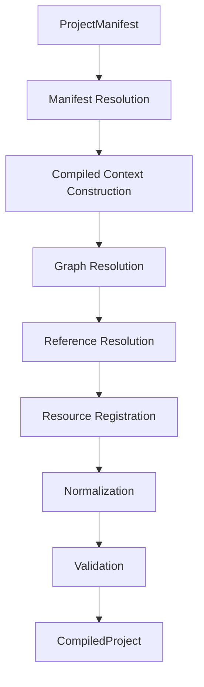

# ProjectCompiler

## Estado

- **Documento:** especificación normativa
- **Ámbito:** compilación de proyectos FLX
- **Versión inicial:** 0.3.0
- **Estado:** consolidado

---

# 1. Propósito

`ProjectCompiler` transforma un proyecto FLX escrito mediante archivos declarativos en un `CompiledProject` completamente resuelto y preparado para su ejecución.

No interpreta el juego ni ejecuta su lógica.

Su responsabilidad es producir una representación ejecutable, estable y autónoma.

---

# 2. Filosofía

El compilador no traduce archivos.

El compilador comprende un proyecto.

```text
project.flx
    │
    ▼
Espacios del proyecto
    │
    ▼
Grafo lógico
    │
    ▼
Referencias resueltas
    │
    ▼
Identidades (ResourceId)
    │
    ▼
CompiledProject
```

---

# 3. Pipeline



Cada fase tiene una responsabilidad concreta.

---

# 4. Fases

## Phase 1 – Manifest Resolution

Entrada:

- ProjectManifest

Responsabilidades:

- resolver espacios del proyecto;
- localizar World;
- localizar Machine;
- localizar Input Mapping.

Salida:

- contexto de compilación.

---

## Phase 2 – Compiled Context Construction

Construye el contexto efectivo que acompañará al proyecto compilado:

- metadata;
- título;
- requisito del motor;
- Machine efectiva;
- input mapping compilado.

---

## Phase 3 – Graph Resolution

Carga el grafo completo del mundo:

- objetos inline;
- referencias;
- `like`;
- hijos;
- scripts declarados.

Todavía pertenece al lenguaje fuente.

---

## Phase 4 – Reference Resolution

Resuelve todas las referencias:

- relativas;
- absolutas;
- internas (`:`);
- `like`;
- scripts.

Al finalizar esta fase no deben quedar referencias pendientes.

---

## Phase 5 – Resource Registration

Todos los recursos válidos reciben una identidad estable (`ResourceId`) y se registran en `ResourceRegistry`.

Las colisiones deben detectarse como error de compilación.

---

## Phase 6 – Normalization

La representación fuente se transforma en representación compilada.

Transformaciones principales:

```text
children            → childResources
scripts externos    → ResourceId
like                → desaparece
referencias         → desaparecen
```

Los objetos registrados no conservan árboles embebidos.

---

## Phase 7 – Validation

Antes de devolver el resultado se validan las invariantes del `CompiledProject`.

Las mismas invariantes deben verificarse posteriormente durante la serialización y lectura del `.flxc`.

---

# 5. CompilationResult

Resultado conceptual:

```text
CompilationResult
├── success
├── diagnostics
└── project
```

Si existe al menos un diagnóstico de error, el proyecto no se considera consumible.

---

# 6. Responsabilidades

ProjectCompiler:

- construye el contexto compilado;
- resuelve referencias;
- registra recursos;
- normaliza el modelo;
- valida el resultado.

No:

- ejecuta el juego;
- interpreta scripts;
- dibuja;
- reproduce audio;
- conoce CLI;
- conoce Builder;
- conoce Tools;
- mantiene estado vivo.

---

# 7. Relación con otros componentes

## ProjectManifest

Define el proyecto de entrada.

## ResourceRegistry

Recibe todos los recursos compilados.

## CompiledProject

Es el único resultado válido de la compilación.

## Runtime

Consume el `CompiledProject` sin reinterpretar las fuentes.

---

# 8. Diagnósticos

Cada fase produce diagnósticos de su dominio:

- PROJECT
- RESOURCE
- COMP
- BINARY

Los códigos públicos se documentan en `diagnostic-codes.md`.

---

# 9. Invariantes

- COMP-001 Toda referencia queda resuelta antes del registro.
- COMP-002 Todo recurso registrado posee un `ResourceId` único.
- COMP-003 No existen rutas pendientes.
- COMP-004 No existen referencias pendientes.
- COMP-005 Todo script registrado existe.
- COMP-006 Todo `childResources` referencia un recurso válido.
- COMP-007 El resultado satisface las invariantes definidas en `compiled-project.md`.

---

# 10. Tests mínimos

Debe verificarse al menos:

- compilación correcta;
- referencias rotas;
- ciclos;
- colisiones;
- scripts inexistentes;
- normalización;
- validación;
- equivalencia entre ejecución desde fuentes y desde `.flxc`.

---

# 11. Compatibilidad

El compilador puede evolucionar internamente siempre que mantenga:

- el contrato de `CompiledProject`;
- el contrato de diagnósticos;
- el formato `.flxc` soportado.

---

# 12. Principio final

El ProjectCompiler no ejecuta un proyecto ni interpreta su comportamiento.

Su única responsabilidad es transformar un lenguaje declarativo en una representación ejecutable, completamente resuelta, estable y autónoma: **CompiledProject**.
