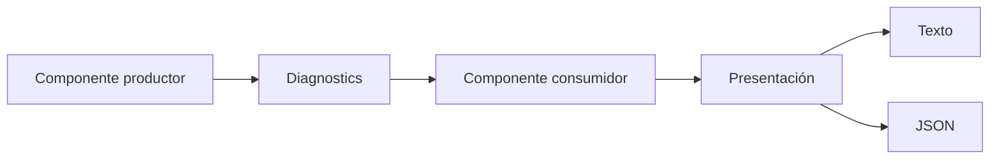
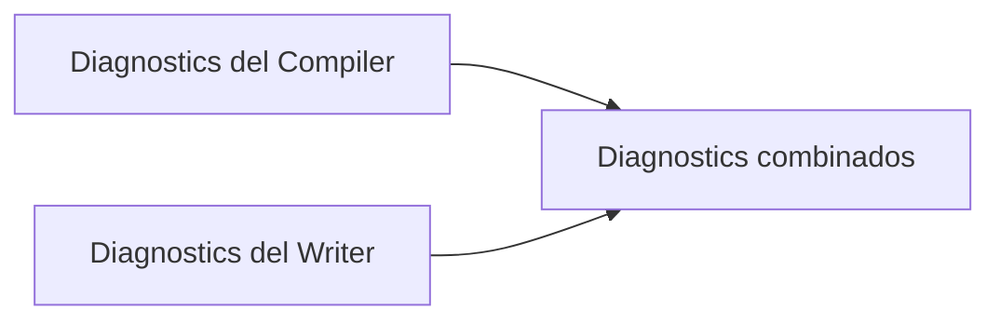
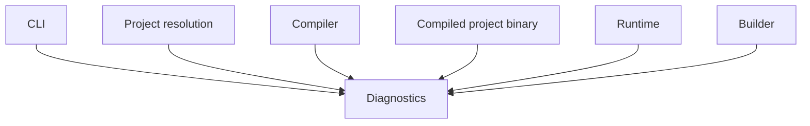

# Diagnósticos de E-Merge FLX

## Estado

- **Documento:** especificación normativa
- **Ámbito:** diagnósticos internos y externos de E-Merge FLX
- **Versión inicial prevista:** 0.3.0
- **Estado:** en consolidación

---

## 1. Propósito

Un diagnóstico representa una incidencia detectada durante una operación de FLX.

Los diagnósticos permiten comunicar:

- información relevante;
- advertencias;
- errores;
- ubicación del problema;
- identidad estable del problema;
- explicación legible para una persona.

Los diagnósticos pueden ser producidos por distintas partes de FLX, entre ellas:

- CLI;
- resolución de proyectos;
- Compiler;
- lectura y escritura de proyectos compilados;
- Runtime;
- Builder;
- Tools futuras.

Los diagnósticos no pertenecen exclusivamente al Compiler.

---

## 2. Responsabilidad

El sistema de diagnósticos DEBE:

- representar incidencias;
- conservar su orden de producción;
- permitir agrupar varias incidencias;
- distinguir severidad;
- identificar de forma estable el tipo de problema;
- conservar contexto suficiente para localizarlo;
- ser independiente de su presentación en texto o JSON.

El sistema de diagnósticos NO DEBE:

- imprimir directamente;
- decidir el código de salida de un proceso;
- detener una operación por sí mismo;
- resolver automáticamente problemas;
- eliminar diagnósticos duplicados sin una regla explícita;
- depender del CLI;
- depender del Compiler;
- depender del Runtime.

---

## 3. Flujo conceptual



El productor crea diagnósticos.

`Diagnostics` los conserva.

El consumidor decide cómo interpretar el resultado de la operación.

La capa de presentación transforma los diagnósticos a texto, JSON u otro formato.

---

## 4. Diagnostic

Un diagnóstico DEBE contener:

- severidad;
- código estable;
- identificador estable;
- mensaje;
- archivo opcional;
- campo opcional.

Representación conceptual:

```text
Diagnostic
  severity
  code
  identifier
  file
  field
  message
```

### 4.1 Severidad

Las severidades iniciales son:

```text
info
warning
error
```

No se añaden más niveles mientras no exista una necesidad real.

### 4.2 Código

El código identifica de forma estable el tipo de problema.

Ejemplos conceptuales:

```text
FLX-CLI-00010
FLX-PROJECT-NOT-FOUND
FLX-COMP-00010
FLX-BINARY-00010
```

El código:

- DEBE ser estable;
- DEBE identificar el dominio del problema;
- DEBE identificar el tipo concreto de incidencia;
- NO DEBE derivarse del mensaje;
- NO DEBE cambiar únicamente porque mejore la redacción del mensaje;
- NO DEBE utilizarse como sustituto del mensaje;
- NO DEBE confundirse con el código de salida del CLI.

### 4.3 Mensaje

El mensaje explica el problema a una persona.

El mensaje:

- DEBE ser claro;
- DEBERÍA ser accionable cuando sea posible;
- PUEDE cambiar entre versiones para mejorar su redacción;
- NO DEBE utilizarse como identificador estable;
- NO DEBE obligar a una Tool a interpretar texto libre.

### 4.4 Archivo

`file` identifica el recurso o archivo relacionado con el diagnóstico.

Es opcional.

Puede representar, según el contexto:

- manifiesto `.flx`;
- JSON;
- YAML;
- JavaScript;
- `.flxc`;
- directorio;
- recurso lógico.

La especificación concreta de rutas se definirá en el documento correspondiente.

### 4.5 Campo

`field` identifica una ubicación lógica dentro del archivo o recurso.

Es opcional.

Ejemplos:

```text
screen.width
children.laser
machine.video.output.scale
behavior.scripts[0]
```

No obliga a utilizar una sintaxis concreta de punteros JSON mientras esta no se consolide.

---

## 5. Severidades

### 5.1 Info

`info` comunica información útil que no representa una anomalía.

Un diagnóstico `info`:

- NO convierte una operación válida en fallida;
- NO requiere intervención;
- PUEDE omitirse en modos de salida reducida;
- DEBE conservarse si la operación solicita información detallada.

Ejemplos:

- recurso detectado;
- Machine utilizada;
- transformación aplicada;
- salida generada.

### 5.2 Warning

`warning` comunica una situación válida pero potencialmente problemática.

Un diagnóstico `warning`:

- NO convierte por sí solo una operación en fallida;
- DEBE conservarse en el resultado;
- DEBERÍA explicar la consecuencia;
- PUEDE indicar comportamiento degradado, ignorado o sustituido.

Ejemplos:

- valor inválido sustituido por un valor por defecto;
- capacidad declarada que no puede utilizarse;
- recurso opcional ignorado;
- configuración válida pero desaconsejada.

### 5.3 Error

`error` comunica una situación que impide completar correctamente la operación.

Un diagnóstico `error`:

- DEBE provocar que la operación se considere fallida;
- DEBE conservarse;
- DEBERÍA identificar con precisión el recurso o campo implicado;
- NO DEBE provocar por sí mismo una excepción no controlada.

Ejemplos:

- proyecto no encontrado;
- referencia inexistente;
- formato compilado incompatible;
- manifiesto inválido;
- recurso obligatorio ausente.

---

## 6. Resultado de una operación

Los diagnósticos forman parte del resultado de una operación, pero no son el resultado completo.

Ejemplo conceptual:

```text
OperationResult
  success
  diagnostics
  value opcional
```

La regla general es:

```text
success = false
si existe al menos un diagnóstico de severidad error
```

Una operación PUEDE fallar por una razón interna sin diagnóstico únicamente si ocurre una condición verdaderamente excepcional.

En ese caso, el componente responsable DEBE generar un diagnóstico antes de devolver el fallo siempre que sea posible.

---

## 7. Colección Diagnostics

`Diagnostics` representa una colección ordenada de diagnósticos.

Debe permitir:

- añadir `info`;
- añadir `warning`;
- añadir `error`;
- consultar todos los diagnósticos;
- consultar si existen errores;
- consultar si está vacía;
- consultar su tamaño;
- combinar otra colección conservando el orden.

Representación conceptual:

```text
Diagnostics
  add
  info
  warning
  error
  append
  hasErrors
  empty
  size
  all
```

---

## 8. Orden

Los diagnósticos DEBEN conservar el orden en que fueron producidos.

El sistema NO DEBE ordenar automáticamente por:

- severidad;
- archivo;
- campo;
- código;
- mensaje.

El orden puede aportar contexto causal.

Ejemplo:

```text
1. no se pudo abrir el archivo
2. no se pudo resolver la referencia
3. no se pudo compilar el recurso
```

Una capa de presentación PUEDE ofrecer una vista agrupada, pero no debe modificar la colección original.

---

## 9. Combinación

Dos colecciones de diagnósticos pueden combinarse.

Ejemplo:



La operación de combinación DEBE:

- conservar todos los diagnósticos;
- conservar el orden interno de cada colección;
- añadir la segunda colección después de la primera;
- no modificar la colección origen;
- no eliminar duplicados automáticamente.

Ejemplo conceptual:

```text
combined = compilerDiagnostics
combined.append(writerDiagnostics)
```

---

## 10. Duplicados

El sistema NO DEBE eliminar diagnósticos duplicados automáticamente.

Dos diagnósticos con el mismo:

- código;
- archivo;
- campo;
- mensaje;

pueden representar eventos distintos.

La deduplicación solo podrá añadirse cuando exista una necesidad concreta y una regla explícita.

---

## 11. Códigos de diagnóstico

### 11.1 Estructura inicial

La forma recomendada es:

```text
FLX-DOMAIN-NNNNN
```

Ejemplo:

```text
FLX-CLI-00010
```

Donde:

- `FLX` identifica el ecosistema;
- `DOMAIN` identifica el subsistema;
- `CATEGORY` agrupa tipos relacionados;
- `NNN` identifica el caso concreto.

### 11.2 Dominios iniciales propuestos

```text
CLI
PROJECT
COMP
RESOURCE
REFERENCE
MACHINE
VIDEO
AUDIO
INPUT
BINARY
RUNTIME
BUILD
```

Esta lista no es definitiva.

Solo deben consolidarse dominios que representen responsabilidades reales.

### 11.3 Estabilidad

Una vez publicado un código como parte de un contrato externo:

- NO DEBE reutilizarse para otro problema;
- NO DEBE cambiar de significado;
- NO DEBE eliminarse sin una decisión de compatibilidad;
- PUEDE mantenerse aunque el mensaje cambie.

### 11.4 Registro

Los códigos públicos DEBEN registrarse en esta especificación o en un documento específico:

```text
diagnostic-codes.md
```

El registro debe incluir:

- código;
- severidad habitual;
- dominio;
- descripción;
- campos de contexto esperados;
- condiciones en las que aparece.

---

## 12. Códigos de diagnóstico y códigos de salida

Los códigos de diagnóstico y los códigos de salida representan conceptos distintos.

### Código de salida

Representa la categoría general del resultado del proceso.

Ejemplo:

```text
4 = CompilationError
```

### Código de diagnóstico

Representa una incidencia concreta.

Ejemplo:

```text
FLX-COMP-00010
```

Un mismo código de salida puede contener varios diagnósticos.

Ejemplo:

```json
{
  "success": false,
  "exitCode": 4,
  "diagnostics": [
    {
      "code": "FLX-COMP-00010"
    },
    {
      "code": "FLX-RESOURCE-NOT-FOUND-001"
    }
  ]
}
```

---

## 13. Presentación

La presentación de diagnósticos pertenece a otra capa.

Ejemplos:

- `DiagnosticPrinter`;
- salida JSON;
- consola;
- Tool gráfica;
- IDE;
- CI.

`Diagnostics` NO DEBE conocer:

- `stdout`;
- `stderr`;
- JSON;
- colores;
- Logger;
- ventanas;
- UI.

---

## 14. Salida textual

La representación textual DEBERÍA incluir:

```text
severity: file [field]: message
```

Ejemplo:

```text
error: objects/player.json [children.laser]: Referenced resource was not found
```

Cuando exista código estable, DEBERÍA incluirse de forma legible.

Ejemplo:

```text
error FLX-COMP-00010: objects/player.json [children.laser]: Referenced resource was not found
```

El formato concreto visible pertenece a la especificación del CLI.

---

## 15. Salida JSON

La representación JSON de un diagnóstico DEBE incluir:

```json
{
  "severity": "error",
  "code": "FLX-COMP-00010",
  "file": "objects/player.json",
  "field": "children.laser",
  "message": "Referenced resource was not found."
}
```

Los campos opcionales pueden representarse como:

- cadena vacía;
- ausencia del campo;
- `null`;

pero la forma definitiva debe ser estable dentro del contrato del CLI.

La decisión concreta se consolida en `cli.md`.

---

## 16. Dependencias

La capa de diagnósticos es transversal.



La capa de diagnósticos NO DEBE depender de ninguno de esos consumidores.

Dirección permitida:

```text
componente
→ diagnostics
```

Dirección prohibida:

```text
diagnostics
→ componente
```

---

## 17. Ubicación conceptual

Diagnostics no pertenece al Compiler.

Debe vivir en una responsabilidad transversal.

Ubicación conceptual recomendada:

```text
engine/diagnostics/
  Diagnostics.h
  Diagnostics.cpp
```

Esto no obliga todavía a convertirlo en una librería independiente.

---

## 18. Excepciones

Los diagnósticos no sustituyen a todas las excepciones internas.

Una excepción puede ser apropiada para:

- invariantes internas rotas;
- errores de programación;
- condiciones realmente inesperadas.

Las condiciones esperables del dominio deben convertirse en diagnósticos.

Ejemplos esperables:

- archivo inexistente;
- formato inválido;
- campo incorrecto;
- referencia rota;
- versión incompatible.

Estas condiciones NO DEBERÍAN escapar como excepciones no controladas hacia el CLI.

---

## 19. Tests

La implementación debe estar respaldada por tests específicos.

### 19.1 Diagnostic

- valores por defecto;
- conservación de severidad;
- conservación de código;
- conservación de archivo;
- conservación de campo;
- conservación de mensaje.

### 19.2 Diagnostics

- colección inicial vacía;
- inserción de info;
- inserción de warning;
- inserción de error;
- conservación del orden;
- `hasErrors()` falso sin errores;
- `hasErrors()` verdadero con errores;
- `empty()`;
- `size()`;
- `append()`;
- `append()` no modifica el origen;
- `append()` de colección vacía;
- ausencia de deduplicación automática.

### 19.3 Presentación

Los tests de presentación pertenecen a la suite correspondiente del CLI.

Deben comprobar:

- texto;
- JSON;
- código;
- severidad;
- archivo;
- campo;
- mensaje;
- separación stdout/stderr;
- JSON válido.

---

## 20. Compatibilidad

Mientras los códigos no se consideren públicos, pueden reorganizarse durante la consolidación.

Una vez consumidos por:

- Tools;
- integraciones;
- CI externo;
- aplicaciones de terceros;

se considerarán parte del contrato público.

A partir de ese momento, cualquier cambio deberá evaluarse como cambio de compatibilidad.

---

## 21. Reglas normativas iniciales

### DIAG-001

Todo diagnóstico DEBE tener severidad.

### DIAG-002

Todo diagnóstico DEBE tener un código estable.

### DIAG-003

Todo diagnóstico DEBE tener un mensaje humano.

### DIAG-004

Archivo y campo son opcionales.

### DIAG-005

Solo la severidad `error` convierte por sí misma una operación en fallida.

### DIAG-006

Los diagnósticos DEBEN conservar el orden de producción.

### DIAG-007

Las colecciones DEBEN poder combinarse sin modificar el origen.

### DIAG-008

No se realiza deduplicación automática.

### DIAG-009

La colección de diagnósticos NO DEBE imprimir ni serializar.

### DIAG-010

Los códigos de diagnóstico NO son códigos de salida del CLI.

### DIAG-011

El mensaje NO es un identificador estable.

### DIAG-012

La capa Diagnostics NO DEBE depender de CLI, Compiler, Runtime ni Builder.

---

## 22. Decisiones pendientes

Antes de considerar estable esta especificación deben consolidarse:

- formato exacto de los códigos;
- dominios iniciales;
- obligatoriedad inmediata o progresiva de `code`;
- representación de campos opcionales en JSON;
- registro central de códigos;
- política de compatibilidad;
- formato textual definitivo con código;
- necesidad real de códigos para diagnósticos `info`;
- tratamiento de errores internos sin diagnóstico;
- relación entre warnings y futuros modos estrictos.

---

## 23. Principio final

Un diagnóstico debe permitir que:

- una persona entienda el problema;
- una Tool identifique el problema;
- un test verifique el problema;
- una implementación futura reproduzca el mismo contrato.

La identidad del problema pertenece al código.

La explicación pertenece al mensaje.

La localización pertenece al archivo y al campo.

La gravedad pertenece a la severidad.


## Actualización

Se adopta el formato `FLX-DOMAIN-NNNNN`, un `Identifier` estable por diagnóstico y campos `file`/`field` siempre presentes como cadena (vacía cuando no aplican).
