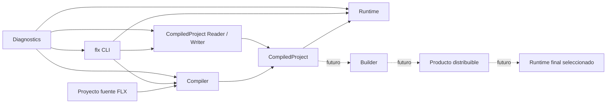
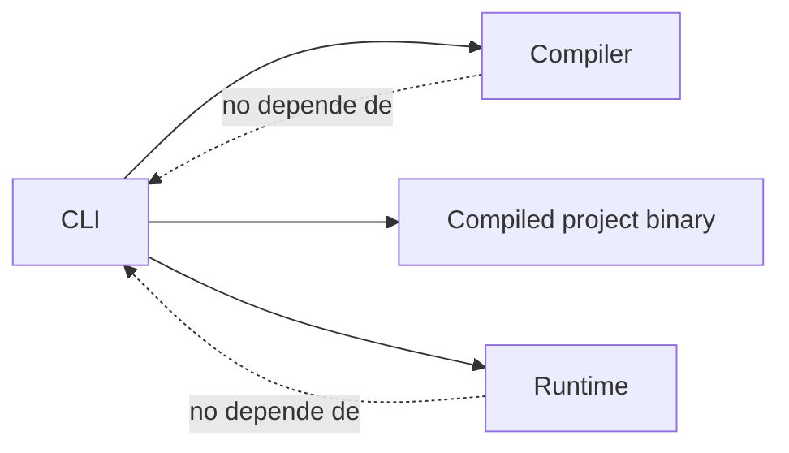
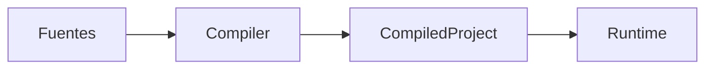
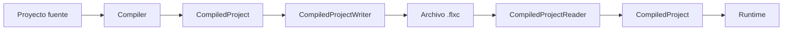
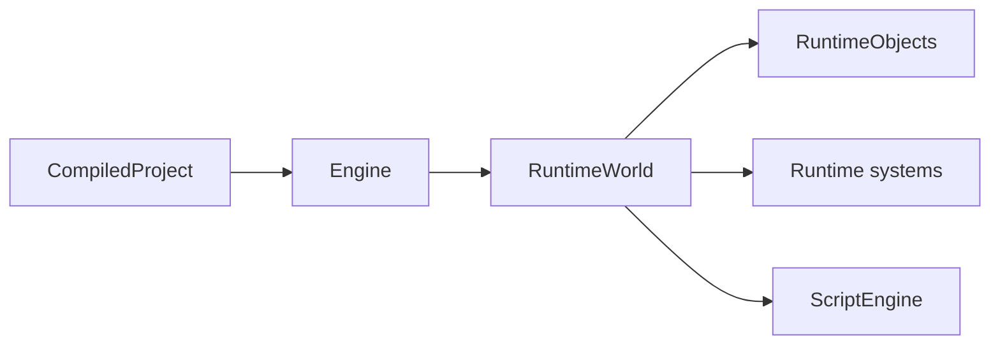
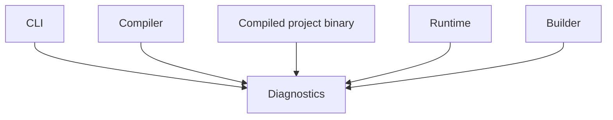
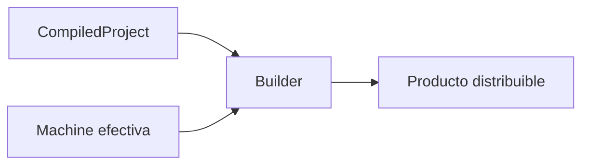
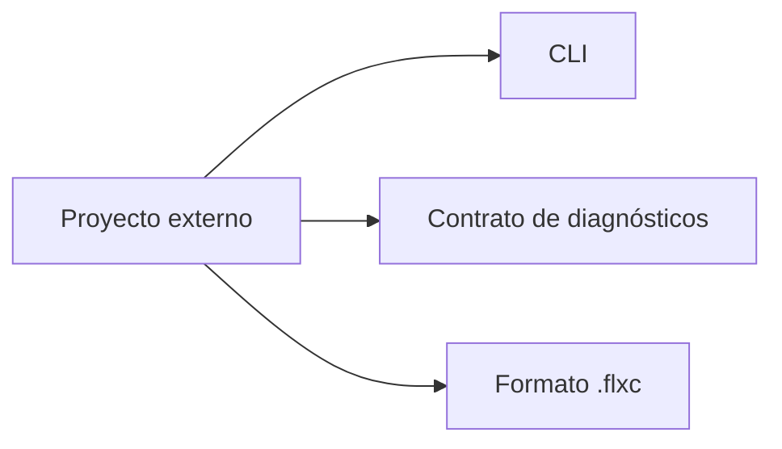
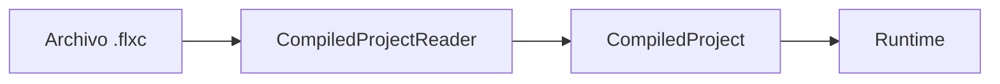
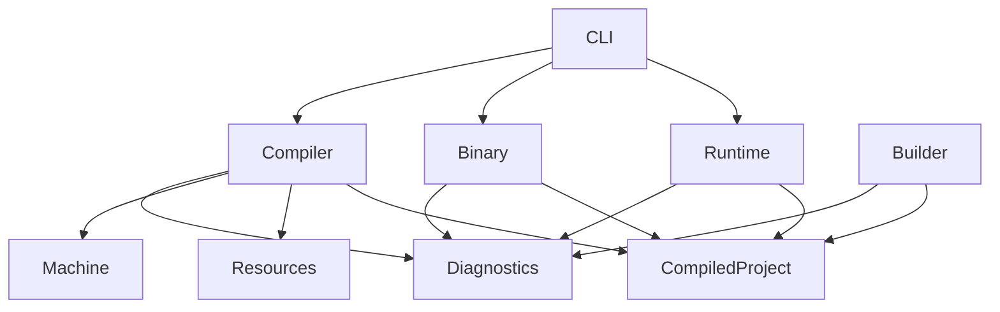

# Ecosistema de E-Merge FLX

## Estado

- **Documento:** especificación conceptual
- **Ámbito:** piezas principales del ecosistema E-Merge FLX
- **Versión inicial prevista:** 0.3.0
- **Estado:** en consolidación

---

## 1. Propósito

Este documento define las piezas principales del ecosistema E-Merge FLX y la relación conceptual entre ellas.

No describe clases concretas de C++.

No describe la implementación interna de una versión específica.

Su objetivo es responder a estas preguntas:

- ¿Qué partes forman E-Merge FLX?
- ¿Qué responsabilidad tiene cada parte?
- ¿Qué produce cada una?
- ¿De qué otras partes puede depender?
- ¿Qué fronteras no deben cruzarse?
- ¿Qué caminos existen desde un proyecto fuente hasta su ejecución?

Este documento actúa como mapa general de la especificación.

Los documentos específicos desarrollan cada responsabilidad con mayor detalle.

---

## 2. Visión general



El proyecto fuente expresa la intención del juego.

El Compiler transforma esa intención en una representación preparada.

`CompiledProject` constituye la frontera entre preparación y ejecución.

El Runtime ejecuta un `CompiledProject`.

El Builder, cuando exista, producirá un producto distribuible a partir de esa representación y de las capacidades necesarias.

El CLI coordina estas capacidades, pero no redefine su comportamiento interno.

Diagnostics es una capacidad transversal utilizada por todas las piezas que necesiten comunicar incidencias.

---

## 3. Principio central

E-Merge FLX separa preparación y ejecución.

```text
Proyecto fuente
→ preparación
→ representación compilada
→ ejecución
```

La preparación comprende, según corresponda:

- carga;
- resolución;
- normalización;
- validación;
- descubrimiento de recursos;
- adaptación a Machine;
- generación de representaciones preparadas.

La ejecución comprende:

- creación del mundo;
- creación de objetos vivos;
- actualización;
- entrada;
- movimiento;
- colisiones;
- audio;
- dibujo;
- scripting;
- cierre.

El Runtime NO DEBE reconstruir el significado del proyecto fuente.

El Compiler NO DEBE ejecutar el juego.

---

## 4. Proyecto fuente

El proyecto fuente es la representación editable de un juego FLX.

Puede contener:

- manifiesto `.flx`;
- recursos JSON;
- scripts JavaScript;
- Machine;
- Chips;
- sprites;
- audio;
- fuentes;
- otros recursos declarativos.

El proyecto fuente está orientado a:

- autoría;
- edición;
- reutilización;
- referencias;
- legibilidad;
- desarrollo.

Puede contener formas abreviadas, referencias, herencia y propiedades que todavía requieren resolución.

El Runtime NO DEBE depender directamente del proyecto fuente una vez exista un `CompiledProject`.

---

## 5. FLX CLI

El CLI es la interfaz de línea de comandos del ecosistema.

Su ejecutable es:

```text
flx
```

Responsabilidades:

- interpretar comandos y opciones;
- resolver el target de un proyecto;
- ejecutar Compiler;
- ejecutar Runtime;
- leer y escribir proyectos compilados;
- presentar resultados y diagnósticos;
- devolver códigos de salida.

El CLI NO DEBE:

- interpretar JSON por su cuenta;
- resolver referencias del juego;
- construir objetos del Runtime;
- implementar reglas propias del Compiler;
- implementar lógica propia del Runtime.

Dirección de dependencia:



La especificación concreta del CLI se encuentra en:

- [CLI](cli.md)

---

## 6. Compiler

El Compiler transforma un proyecto fuente en un `CompiledProject`.

Entrada:

```text
proyecto fuente
```

Salida:

```text
CompiledProject
```

Responsabilidades conceptuales:

- cargar el manifiesto;
- cargar Machine y Chips;
- descubrir recursos;
- resolver referencias;
- resolver herencia;
- validar;
- normalizar;
- identificar scripts;
- construir el registro de recursos;
- producir una representación preparada.

El Compiler NO DEBE:

- abrir una ventana;
- reproducir audio;
- ejecutar scripts;
- crear objetos vivos;
- iniciar el loop del juego;
- imprimir directamente.

Todos los errores, warnings e información deben comunicarse mediante Diagnostics.

Documento previsto:

- `compiler.md`

---

## 7. CompiledProject

`CompiledProject` representa un proyecto listo para ser ejecutado.

Es la frontera estable entre Compiler y Runtime.

Debe contener, como mínimo conceptual:

- Machine efectiva;
- configuración final necesaria para ejecución;
- recurso raíz;
- registro de recursos;
- definiciones resueltas;
- scripts preparados;
- relaciones necesarias entre recursos.

No debe contener:

- referencias sin resolver;
- herencia pendiente;
- JSON original;
- estado vivo;
- objetos activos;
- punteros dependientes de un proceso concreto;
- decisiones de autoría pendientes.



Documento previsto:

- `compiled-project.md`

---

## 8. Registro de recursos

El registro de recursos forma parte de la representación compilada.

Su responsabilidad es proporcionar acceso estable a las definiciones necesarias durante la ejecución.

Debe permitir:

- identificar recursos;
- evitar cargas repetidas;
- reutilizar definiciones;
- resolver relaciones entre recursos;
- crear múltiples instancias desde una misma definición.

El Runtime debe consultar definiciones compiladas mediante identidad lógica.

No debe abrir archivos JSON durante la ejecución.

Documento previsto:

- `resources.md`

---

## 9. Proyecto compilado persistente

Un `CompiledProject` puede serializarse como archivo `.flxc`.



El formato persistente permite:

- ejecutar sin fuentes;
- distribuir una representación cerrada;
- verificar compatibilidad;
- servir de base al futuro Builder;
- separar autoría y ejecución.

La versión del formato `.flxc` es independiente de la versión del CLI.

Documento previsto:

- `compiled-project.md`
- `compiled-project-format.md`, si el formato requiere una especificación separada.

---

## 10. Runtime

El Runtime ejecuta un `CompiledProject`.

Entrada:

```text
CompiledProject
```

Responsabilidades:

- inicializar sistemas;
- crear el mundo;
- crear objetos vivos;
- ejecutar scripts;
- procesar entrada;
- actualizar movimiento;
- resolver colisiones;
- reproducir audio;
- dibujar;
- gestionar el ciclo de vida;
- finalizar correctamente.

El Runtime NO DEBE:

- abrir `project.flx`;
- cargar JSON;
- cargar YAML;
- resolver referencias;
- resolver herencia;
- decidir precedencias de autoría;
- interpretar opciones del CLI.



Documentos previstos:

- `runtime.md`
- `lifecycle.md`

---

## 11. Machine y Chips

La Machine define las capacidades del entorno donde existe el juego.

El juego expresa intención.

La Machine expresa posibilidad.

El Runtime ejecuta esa intención dentro de las capacidades declaradas.

Los Chips iniciales son:

- Video Chip;
- Audio Chip;
- Input Chip.

Machine y Chips forman parte de la preparación del proyecto y de la representación compilada efectiva.

No representan hardware concreto.

No emulan consolas.

Documentos previstos:

- `machine.md`
- `video-chip.md`
- `audio-chip.md`
- `input-chip.md`

---

## 12. Diagnostics

Diagnostics es una capacidad transversal.

Puede ser utilizada por:

- CLI;
- resolución de proyectos;
- Compiler;
- lectura y escritura de `.flxc`;
- Runtime;
- Builder.

Diagnostics conserva:

- severidad;
- código;
- identificador;
- archivo;
- campo;
- mensaje;
- rango opcional.

Diagnostics NO DEBE imprimir ni decidir códigos de salida.



Documentos:

- [Diagnostics](diagnostics.md)
- [Códigos de diagnóstico](diagnostic-codes.md)

---

## 13. Builder

El Builder es una capacidad futura.

Su responsabilidad será producir un producto distribuible.

Entrada conceptual:

```text
CompiledProject
+ Machine efectiva
+ módulos necesarios
```

Salida conceptual:

```text
ejecutable
+ recursos compilados
+ manifest de distribución
```

El Builder podrá seleccionar únicamente las capacidades necesarias para un proyecto.

No debe redefinir el significado del juego.

Debe utilizar la misma representación compilada que el Runtime.



El Builder no forma parte del CLI.

El CLI podrá exponer un comando que lo invoque cuando exista.

Documento previsto:

- `builder.md`

---

## 14. Productos externos

Otros proyectos pueden consumir contratos de E-Merge FLX.

Ejemplos posibles:

- editor;
- Tool gráfica;
- Hub;
- integración con IDE;
- servidor LSP;
- automatizaciones;
- CI;
- aplicaciones de distribución.

Estos proyectos son independientes.

No forman parte del núcleo FLX ni condicionan su arquitectura interna.

Dependen de contratos públicos como:

- CLI;
- Diagnostics;
- `.flxc`;
- manifests;
- schemas;
- API documentada.



El núcleo FLX NO DEBE depender de consumidores externos concretos.

---

## 15. Caminos de ejecución

### 15.1 Desde fuentes


### 15.2 Desde proyecto compilado



Ambos caminos DEBEN converger en `CompiledProject`.

No deben existir runtimes distintos para cada origen.

---

## 16. Fronteras de responsabilidad

### CLI

Coordina.

### Compiler

Prepara.

### CompiledProject

Representa.

### Runtime

Ejecuta.

### Builder

Produce distribución.

### Diagnostics

Comunica incidencias.

### Machine

Define capacidades.

### Recursos

Definen contenido y comportamiento.

---

## 17. Dependencias permitidas



---

## 18. Dependencias prohibidas

El Runtime NO DEBE depender del CLI.

El Compiler NO DEBE depender del CLI.

Diagnostics NO DEBE depender del CLI, Compiler, Runtime ni Builder.

`CompiledProject` NO DEBE depender del proyecto fuente.

El proyecto fuente NO DEBE conocer detalles internos del Runtime.

Los consumidores externos NO DEBEN convertirse en dependencias del núcleo FLX.

---

## 19. Relación entre especificaciones

Este documento ofrece la vista global.

Cada responsabilidad debe desarrollarse en su documento específico.

```text
ecosystem.md
├── cli.md
├── diagnostics.md
├── diagnostic-codes.md
├── compiler.md
├── compiled-project.md
├── resources.md
├── runtime.md
├── lifecycle.md
├── project-manifest.md
├── machine.md
├── video-chip.md
├── audio-chip.md
├── input-chip.md
└── builder.md
```

No todos los documentos tienen que existir desde el inicio.

Se crean cuando la responsabilidad correspondiente se audita y consolida.

---

## 20. Principio de evolución

FLX debe crecer a partir de necesidades reales.

Una nueva pieza del ecosistema solo debe añadirse cuando:

- tenga una responsabilidad propia;
- no duplique otra existente;
- simplifique una frontera;
- pueda especificarse;
- pueda probarse;
- surja de una necesidad real.

La arquitectura no debe anticipar sistemas completos sin una necesidad concreta.

---

## 21. Regla final

Cada pieza del ecosistema debe responder a una pregunta diferente:

```text
CLI
¿Qué operación se solicita?

Compiler
¿Qué significa el proyecto?

CompiledProject
¿Qué debe ejecutarse?

Runtime
¿Cómo se ejecuta?

Machine
¿Qué es posible?

Builder
¿Qué producto se distribuye?

Diagnostics
¿Qué ha ocurrido?
```

Si dos piezas responden a la misma pregunta, existe riesgo de duplicidad.

Si una pieza responde a demasiadas preguntas, existe riesgo de acoplamiento.
