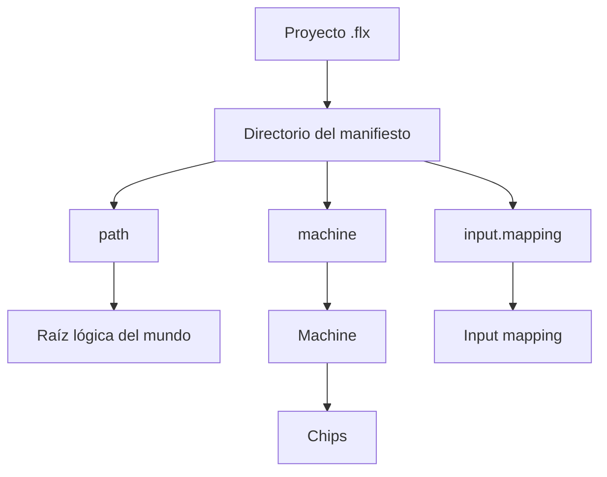
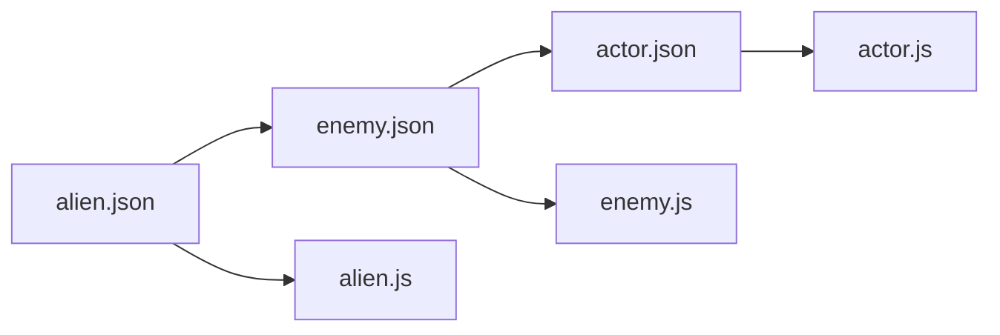
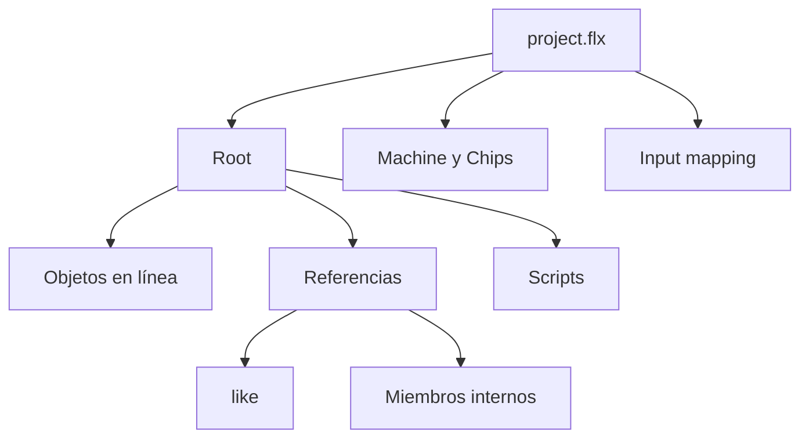

# Referencias de recursos en E-Merge FLX

## Estado

- **Documento:** especificación normativa
- **Ámbito:** resolución de recursos declarados en proyectos FLX
- **Versión inicial prevista:** 0.3.0
- **Estado:** en consolidación

---

## 1. Propósito

Este documento define cómo E-Merge FLX interpreta, resuelve y valida referencias a recursos.

Una referencia forma parte del lenguaje fuente de FLX.

Permite declarar un elemento de dos formas equivalentes:

```json
"algo": {
  "type": "block"
}
```

o:

```json
"algo": "/algo"
```

Ambas formas deben producir una representación compilada equivalente.

La diferencia pertenece únicamente a la autoría y a la procedencia del recurso.

El Runtime no debe conocer si una definición fue escrita:

- en línea;
- por referencia;
- mediante `like`;
- mediante una referencia interna;
- mediante una cadena de reutilización.

---

## 2. Principio fundamental

Las referencias deben resolverse completamente antes de crear un `CompiledProject`.


El Runtime no debe:

- abrir archivos JSON;
- interpretar rutas;
- resolver `like`;
- localizar scripts;
- localizar miembros internos;
- aplicar raíces lógicas;
- decidir la procedencia de una referencia.

---

## 3. Declaración en línea y por referencia

Estas dos formas son conceptualmente equivalentes:

```json
"laser": {
  "shape": {
    "type": "block"
  }
}
```

```json
"laser": "weapons/laser"
```

La primera declara el recurso en línea.

La segunda declara que el recurso se obtiene desde otra fuente.

Tras la compilación, ambas deben producir:

- una `ObjectDefinition` válida;
- una identidad de recurso;
- una relación compilada;
- ausencia de rutas pendientes.

La equivalencia del resultado no elimina la necesidad de conservar la procedencia para diagnósticos.

---

## 4. Ancla del proyecto

El archivo `.flx` es el punto de partida del proyecto.

Ejemplo:

```text
C:/juegos/mi_juego/juego.flx
```

Su directorio es:

```text
C:/juegos/mi_juego
```

Ese directorio es la base conceptual del proyecto.

Desde él se resuelven las rutas declaradas directamente en el manifiesto:

- `path`;
- `machine`;
- `input.mapping`.

---

## 5. Raíz del mundo

La propiedad `path` define la raíz lógica de los recursos del mundo.

Ejemplos:

```text
path=mundo
```

```text
C:/juegos/mi_juego/mundo
```

```text
path=.
```

```text
C:/juegos/mi_juego
```

```text
path=../recursos
```

```text
C:/juegos/recursos
```

```text
path=C:/juegos/juego_mundo
```

```text
C:/juegos/juego_mundo
```

`path` puede ser:

- relativo;
- absoluto;
- el directorio actual;
- un directorio exterior al manifiesto.

La raíz del mundo contiene conceptualmente:

- JSON;
- JavaScript;
- recursos declarativos;
- sonidos;
- música;
- sprites futuros;
- fuentes futuras;
- otros recursos del juego.

La Machine y sus Chips no tienen que encontrarse dentro de esta raíz.

---

## 6. Espacios independientes

El manifiesto combina espacios conceptualmente distintos:



`path` define el espacio del mundo.

`machine` selecciona el medio.

`input.mapping` selecciona un mapeo de entrada.

No existe obligación de que estos elementos compartan directorio.

---

## 7. Bases de resolución

| Declaración | Base de resolución |
|---|---|
| `path` | directorio del `.flx` |
| `machine` | directorio del `.flx` |
| `input.mapping` | directorio del `.flx` |
| `root` | raíz efectiva de `path` |
| referencia lógica `/resource` | raíz efectiva de `path` |
| referencia relativa dentro de JSON | archivo que la declaró |
| Chip declarado por una Machine | archivo o directorio de la Machine que lo declaró |

Estas bases no deben intercambiarse.

---

## 8. Referencias absolutas lógicas

Una referencia que comienza por `/` es absoluta dentro del mundo.

Ejemplo:

```json
"music": "/commons/musics:composite1"
```

La barra inicial no representa:

```text
C:/
```

Representa:

```text
path
```

Si:

```text
path=games
```

entonces:

```text
/commons/musics:composite1
```

se resuelve desde:

```text
games/commons/musics.json
```

La referencia absoluta lógica debe ser independiente del archivo que la declara.

---

## 9. Referencias relativas

Una referencia relativa se resuelve desde el archivo que la declaró.

Ejemplos:

```text
enemy
./enemy
../commons/enemy
```

Si se declara en:

```text
world/asteroids/alien.json
```

entonces:

```text
../commons/enemy
```

se resuelve desde:

```text
world/asteroids/
```

La base no debe cambiar porque el recurso sea reutilizado por otro archivo.

---

## 10. Procedencia

Toda referencia relativa debe conservar la procedencia del lugar donde fue escrita originalmente.

Ejemplo:

```text
world/
├── commons/
│   ├── enemy.json
│   └── enemy.js
└── asteroids/
    ├── alien.json
    └── alien.js
```

`enemy.json`:

```json
{
  "scripts": ["enemy"]
}
```

`alien.json`:

```json
{
  "like": "../commons/enemy"
}
```

El script heredado debe resolverse como:

```text
world/commons/enemy.js
```

No como:

```text
world/asteroids/enemy.js
```

La reutilización no puede cambiar el significado de una referencia heredada.

---

## 11. Sobrescritura

Cuando un consumidor sobrescribe una propiedad, la nueva referencia pertenece al archivo consumidor.

Ejemplo:

`enemy.json`:

```json
{
  "scripts": ["enemy"]
}
```

`alien.json`:

```json
{
  "like": "../commons/enemy",
  "scripts": ["alien"]
}
```

El script final debe resolverse como:

```text
world/asteroids/alien.js
```

No como:

```text
world/commons/alien.js
```

La procedencia es propia de cada referencia, no del objeto final completo.

---

## 12. `like`

`like` permite reutilizar y extender una definición.

La resolución debe respetar estas reglas:

- el recurso base se resuelve desde el archivo que declara `like`;
- las referencias heredadas conservan la procedencia del recurso base;
- las referencias sobrescritas adoptan la procedencia del consumidor;
- una cadena de `like` conserva la procedencia de cada nivel;
- los ciclos deben detectarse;
- el Runtime no debe conocer `like`.

Ejemplo conceptual:



Cada script conserva la procedencia del archivo que lo declaró.

---

## 13. Referencias internas

Una referencia puede seleccionar un miembro concreto dentro de un archivo.

Ejemplo:

```text
/commons/musics:composite1
```

Se divide en:

```text
archivo
/commons/musics
```

y:

```text
miembro interno
composite1
```

El Compiler debe distinguir:

- archivo inexistente;
- archivo válido pero miembro inexistente;
- miembro existente pero inválido;
- ciclo de referencias internas.

Un miembro interno no debe confundirse con una ruta física.

---

## 14. Scripts

Los scripts son recursos del mundo.

Una referencia a un script:

- puede ser relativa;
- puede ser absoluta lógica;
- debe respetar procedencia;
- debe resolverse antes del Runtime;
- debe incorporarse al `ResourceRegistry`;
- debe quedar disponible como contenido compilado.

El Runtime no debe abrir el archivo JavaScript original.

---

## 15. Machine y Chips

La Machine se resuelve desde el directorio del `.flx`.

Sus Chips pueden declararse:

- en línea;
- por referencia.

Las referencias a Chips se resuelven desde la Machine o el archivo que las declara.

La raíz del mundo definida por `path` no afecta a las rutas de Machine y Chips.

---

## 16. Input mapping

`input.mapping` se resuelve desde el directorio del `.flx`.

No forma parte necesariamente del mundo.

Si se declara:

- debe existir;
- debe poder leerse;
- debe validarse;
- debe incorporarse a la representación compilada;
- no debe volver a abrirse en Runtime.

---

## 17. Validación del grafo

`flx validate` debe recorrer el mismo grafo fuente que `flx compile`.



`validate` debe detectar:

- manifiesto inválido;
- root inexistente;
- JSON inválido;
- referencia inexistente;
- miembro interno inexistente;
- `like` inexistente;
- ciclos;
- scripts inexistentes;
- input mapping inexistente;
- Machine o Chips inválidos;
- colisiones de `ResourceId`;
- errores de lectura;
- referencias no resolubles;
- cualquier incapacidad para construir un `CompiledProject` válido.

`validate` no:

- ejecuta el juego;
- crea RuntimeObjects;
- persiste `.flxc`.

---

## 18. Diagnósticos de resolución

Un diagnóstico de referencia debe permitir entender:

- qué referencia se declaró;
- dónde se declaró;
- qué base se utilizó;
- qué ruta se calculó;
- qué tipo de recurso se esperaba;
- qué parte concreta falló.

Ejemplo textual:

```text
error FLX-RESOURCE-00010 MissingReferencedResource:
asteroids/enemies/alien.json [children.laser]:
Referenced resource '../weapons/laser' could not be found.
Resolved path: C:/juegos/mi_juego/mundo/asteroids/weapons/laser.json
```

---

## 19. Contexto estructurado

Los detalles de resolución no deben existir únicamente en el mensaje humano.

Un diagnóstico puede incluir contexto estructurado opcional.

Ejemplo conceptual:

```json
{
  "severity": "error",
  "code": "FLX-RESOURCE-00010",
  "identifier": "MissingReferencedResource",
  "file": "asteroids/enemies/alien.json",
  "field": "children.laser",
  "message": "Referenced resource could not be found.",
  "details": {
    "reference": "../weapons/laser",
    "basePath": "C:/juegos/mi_juego/mundo/asteroids/enemies",
    "resolvedPath": "C:/juegos/mi_juego/mundo/asteroids/weapons/laser.json",
    "expectedType": "json",
    "member": ""
  }
}
```

La estructura exacta de `details` debe consolidarse antes de incorporarla al contrato público.

---

## 20. Sitio de uso y sitio de definición

Un diagnóstico puede necesitar dos ubicaciones distintas.

### Sitio de uso

Lugar donde se escribió la referencia.

Ejemplo:

```json
"laser": "../weapons/laser"
```

### Sitio de definición

Lugar donde se encuentra el error dentro del recurso referenciado.

Ejemplo:

```text
weapons/laser.json [shape.type]
```

Las Tools deben poder distinguir:

- referencia rota;
- recurso encontrado pero inválido.

---

## 21. Cadenas de referencia

Una referencia puede atravesar varios niveles.

Ejemplo:

```text
alien.json
→ like enemy.json
→ like actor.json
→ script actor.js
```

El Compiler debe poder diagnosticar la cadena cuando sea necesario.

Ejemplo conceptual:

```json
{
  "details": {
    "referenceChain": [
      "asteroids/alien.json",
      "commons/enemy.json",
      "commons/actor.json"
    ]
  }
}
```

La cadena no debe calcularse en Runtime.

---

## 22. ResourceId

Toda definición compilada debe recibir una identidad estable.

El `ResourceId`:

- no debe depender de una ruta absoluta del sistema;
- debe ser portable;
- debe distinguir recursos distintos;
- debe detectar colisiones;
- debe permitir reutilización;
- debe permitir localizar definiciones desde Runtime.

Una colisión nunca debe ignorarse silenciosamente.

```text
misma identidad + misma definición
→ reutilización válida

misma identidad + definición distinta
→ error
```

---

## 23. Códigos iniciales propuestos

Los siguientes diagnósticos están suficientemente definidos para ser candidatos estables:

```text
FLX-RESOURCE-00010
MissingReferencedResource

FLX-RESOURCE-00011
MissingInternalResourceMember

FLX-RESOURCE-00012
ResourceReferenceCycle

FLX-RESOURCE-00013
ResourceIdCollision

FLX-RESOURCE-00014
ReferencedScriptNotFound

FLX-PROJECT-00010
ProjectRootNotFound

FLX-MACHINE-00010
MachineResourceNotFound
```

Los códigos deben añadirse a `diagnostic-codes.md` solo cuando se implementen.

---

## 24. Tests de caracterización

Antes de refactorizar el sistema de carga deben existir tests para:

- objeto en línea;
- objeto por referencia;
- referencia absoluta lógica;
- referencia relativa;
- miembro interno;
- miembro interno inexistente;
- script heredado mediante `like`;
- script sobrescrito;
- hijo heredado;
- bloque externo heredado;
- cadena de varios `like`;
- ciclo de `like`;
- dos compilaciones consecutivas con raíces distintas;
- colisión de `ResourceId`;
- ruta resuelta incluida en el diagnóstico.

---

## 25. Estado global de carga

La raíz del mundo y el cache de JSON pertenecen a una compilación concreta.

No deben ser estado global compartido por el proceso.

Una sesión de compilación debe poseer:

- raíz lógica;
- cache;
- cadena de referencias;
- contexto de procedencia;
- Diagnostics.

Esto permitirá:

- validar varios proyectos;
- recompilar;
- ejecutar Tools;
- evitar contaminación entre proyectos;
- permitir paralelismo futuro.

---

## 26. Reglas normativas

### REF-001

Una referencia debe resolverse completamente antes del Runtime.

### REF-002

La declaración en línea y por referencia producen una representación compilada equivalente.

### REF-003

`path` define la raíz lógica del mundo.

### REF-004

Las rutas del manifiesto se resuelven desde el directorio del `.flx`.

### REF-005

Las referencias absolutas lógicas se resuelven desde `path`.

### REF-006

Las referencias relativas se resuelven desde el archivo que las declaró.

### REF-007

`like` no puede cambiar la procedencia de una referencia heredada.

### REF-008

Una sobrescritura adopta la procedencia del archivo consumidor.

### REF-009

Las referencias internas deben distinguir archivo y miembro.

### REF-010

Los ciclos deben diagnosticarse.

### REF-011

Las colisiones de `ResourceId` no pueden ignorarse.

### REF-012

`validate` y `compile` recorren el mismo grafo fuente.

### REF-013

El Runtime no interpreta referencias.

### REF-014

La raíz y el cache pertenecen a una sesión de compilación.

### REF-015

Los diagnósticos deben mostrar la ruta efectiva utilizada cuando una resolución falla.

---

## 27. Principio final

Una referencia debe conservar tres cosas hasta quedar compilada:

```text
qué se declaró
dónde se declaró
en qué recurso terminó
```

La forma fuente puede desaparecer.

La procedencia necesaria para diagnosticar no debe perderse.

El Runtime solo recibe el resultado resuelto.
