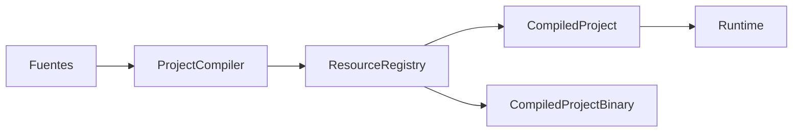

# ResourceRegistry

## Estado

- Documento: especificación normativa
- Ámbito: espacio de identidades y recursos compilados
- Versión inicial: 0.3.0
- Estado: consolidado

---

## 1. Propósito

`ResourceRegistry` es el propietario del espacio de identidades de un `CompiledProject`.

Mantiene la relación estable:

```text
ResourceId
→ recurso compilado
```

No representa archivos fuente. Representa recursos ya comprendidos y compilados.

---

## 2. Filosofía

FLX separa dos mundos.

### Mundo del desarrollador

```text
project.flx
JSON
YAML
JavaScript
rutas
referencias
like
```

### Mundo compilado

```text
ResourceId
ResourceRegistry
CompiledProject
RuntimeObject
```

El compilador transforma documentos en identidades.

El Runtime transforma identidades en instancias.

---

## 3. Arquitectura



---

## 4. Responsabilidad principal

`ResourceRegistry` garantiza que:

```text
todo recurso compilado
→ posee exactamente un ResourceId
```

y:

```text
todo ResourceId registrado
→ identifica exactamente un recurso
```

No debe existir:

```text
un ResourceId
→ dos recursos distintos
```

---

## 5. Modelo conceptual

```text
ResourceRegistry
├── objectResources
└── scriptResources
```

Representación:

```text
ResourceId
→ ObjectDefinition compilada

ResourceId
→ ScriptResource
```

---

## 6. ResourceId

`ResourceId` identifica un recurso dentro del proyecto compilado.

Debe ser:

- estable durante la ejecución;
- determinista;
- portable;
- independiente del orden de carga;
- independiente de direcciones de memoria;
- suficiente para localizar el recurso.

No debe depender accidentalmente de:

- rutas absolutas;
- separadores del sistema operativo;
- orden de inserción;
- estado global del proceso.

---

## 7. Espacio de nombres

El conjunto de todos los `ResourceId` forma el espacio de identidades del proyecto compilado.

Ese espacio pertenece al `CompiledProject`.

No es global al proceso.

Dos proyectos distintos pueden contener el mismo `ResourceId` sin conflicto porque poseen registros diferentes.

---

## 8. Tipos de recurso actuales

### Objetos

```text
ResourceId
→ ObjectDefinition compilada
→ RuntimeObject
```

### Scripts

```text
ResourceId
→ ScriptResource
→ ScriptEngine
```

---

## 9. Tipos de recurso futuros

La arquitectura debe permitir incorporar nuevos tipos sin modificar el contrato básico:

```text
SpriteResource
SoundResource
MusicResource
FontResource
PaletteResource
ShaderResource
TileSetResource
```

Cada nuevo tipo deberá definir:

- generación de identidad;
- representación compilada;
- serialización;
- consumidor;
- invariantes;
- tests.

---

## 10. Registro

Registrar un recurso incorpora de forma definitiva una identidad y su contenido al proyecto compilado.

Una operación de registro debe:

- rechazar IDs vacíos;
- rechazar colisiones;
- conservar el primer recurso;
- no sustituir silenciosamente;
- no ignorar silenciosamente;
- producir Diagnostics cuando falle.

---

## 11. Reutilización y colisión

### Reutilización válida

```text
misma identidad
+
mismo recurso lógico
→ reutilización
```

### Colisión

```text
misma identidad
+
recurso lógico distinto
→ error
```

Una colisión utiliza:

```text
FLX-RESOURCE-00013
ResourceIdCollision
```

---

## 12. Consulta

El registro permite localizar recursos por `ResourceId`.

Conceptualmente:

```text
contains
find
get
objects
scripts
```

La consulta:

- no modifica;
- no crea;
- no carga;
- no resuelve;
- no ejecuta;
- no instancia.

---

## 13. Inmutabilidad

Durante la compilación el registro está en construcción.

Cuando se crea un `CompiledProject` válido, el registro se considera inmutable.

```text
ProjectCompiler
→ registro mutable

CompiledProject
→ registro estable

Runtime
→ solo lectura
```

El Runtime no añade, sustituye, elimina ni modifica recursos.

---

## 14. Recursos e instancias

Un recurso no es una instancia.

```text
ObjectDefinition
≠
RuntimeObject
```

Una misma definición puede producir múltiples instancias.

El registro no contiene:

- posición;
- velocidad;
- estado;
- vida;
- visibilidad;
- relaciones de Runtime.

---

## 15. Relación con ProjectCompiler

`ProjectCompiler`:

- genera `ResourceId`;
- normaliza definiciones;
- registra objetos;
- registra scripts;
- detecta colisiones;
- valida relaciones.

El registro no compila. Conserva el resultado compilado.

---

## 16. Relación con CompiledProject

```text
CompiledProject
├── context
├── rootId
└── resources
```

`rootId` debe existir en el registro.

Toda relación compilada termina en un recurso registrado.

---

## 17. Relación con Runtime

El Runtime accede únicamente mediante `ResourceId`.

```text
rootId
→ ResourceRegistry
→ ObjectDefinition
→ RuntimeObject
```

La misma regla se aplica a:

- hijos;
- grid;
- spawn;
- scripts;
- futuros recursos.

---

## 18. Relación con `.flxc`

`.flxc` persiste el contenido del registro.

Debe conservar:

- ResourceId;
- tipo;
- contenido compilado;
- orden determinista.

```text
ResourceRegistry
→ Writer
→ .flxc
→ Reader
→ ResourceRegistry
```

El registro reconstruido debe ser semánticamente equivalente.

---

## 19. Determinismo

El contenido lógico no depende del orden de descubrimiento.

La serialización debe usar un orden estable.

Esto permite:

- builds reproducibles;
- tests;
- comparación;
- hashing futuro;
- verificación de integridad.

---

## 20. Lo que no hace

`ResourceRegistry` no:

- abre archivos;
- interpreta JSON o YAML;
- ejecuta JavaScript;
- dibuja;
- reproduce audio;
- gestiona input;
- conoce CLI;
- conoce Builder;
- conoce Tools;
- crea RuntimeObject;
- destruye RuntimeObject;
- mantiene estado vivo;
- resuelve referencias;
- aplica `like`.

---

## 21. Invariantes normativas

### REG-001 — Identidad obligatoria

Todo recurso posee un `ResourceId` no vacío.

### REG-002 — Unicidad

Todo `ResourceId` identifica exactamente un recurso.

### REG-003 — Sin sustitución silenciosa

Un recurso registrado no puede sustituirse sin error.

### REG-004 — Fuente única

El registro es la fuente única de recursos compilados.

### REG-005 — Solo lectura en Runtime

El Runtime accede al registro en modo de solo lectura.

### REG-006 — Separación recurso/instancia

El registro no contiene `RuntimeObject`.

### REG-007 — Portabilidad

Los IDs no dependen de rutas absolutas ni detalles accidentales del host.

### REG-008 — Relaciones válidas

Toda relación compilada apunta a un recurso registrado.

### REG-009 — Persistencia equivalente

Escribir y leer `.flxc` produce un registro equivalente.

### REG-010 — Alcance por proyecto

Cada `CompiledProject` posee su propio espacio de identidades.

---

## 22. Tests mínimos

Deben existir pruebas para:

- registro de objeto;
- registro de script;
- consulta;
- recurso inexistente;
- ID vacío;
- colisión;
- ausencia de sustitución;
- orden estable;
- rootId existente;
- childResources válidos;
- scripts válidos;
- serialización;
- lectura;
- equivalencia binaria;
- ejecución sin fuentes;
- registros independientes con el mismo ID.

---

## 23. Compatibilidad

La implementación interna puede cambiar si mantiene:

- estabilidad de identidad;
- unicidad;
- inmutabilidad en Runtime;
- contrato de búsqueda;
- equivalencia tras serialización.

Antes de la v1 debe definirse la política de estabilidad de IDs entre versiones.

---

## 24. Evolución

La incorporación de nuevos recursos debe seguir este flujo:

```text
definición fuente
→ compilación
→ recurso compilado
→ registro
→ serialización
→ consumidor
→ tests
→ documentación
```

---

## 25. Principio final

El desarrollador trabaja con documentos.

El compilador trabaja con significado.

`ResourceRegistry` trabaja con identidades.

El Runtime trabaja con instancias.

```text
documentos
→ identidades
→ instancias
```
