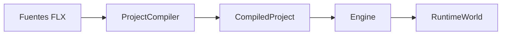
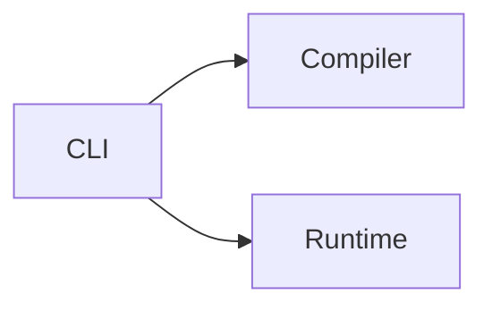
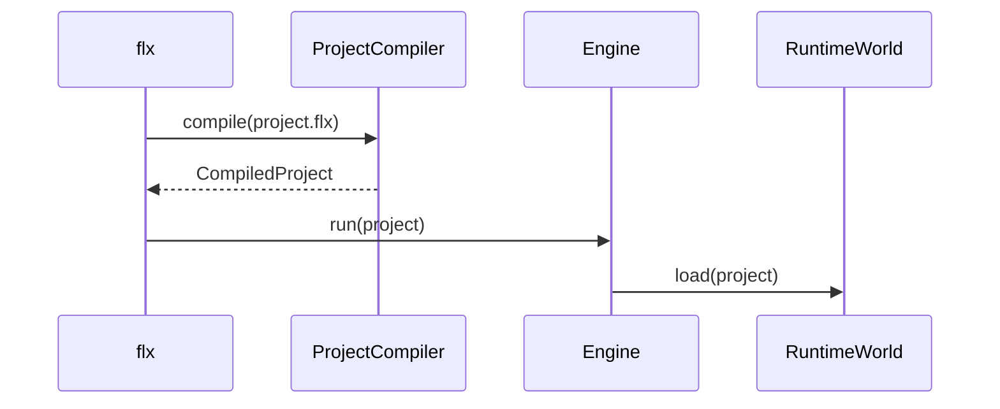
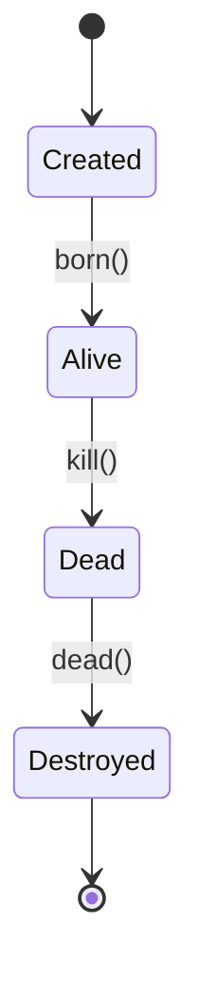
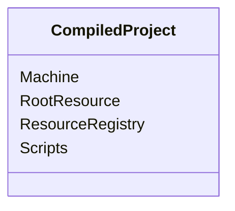
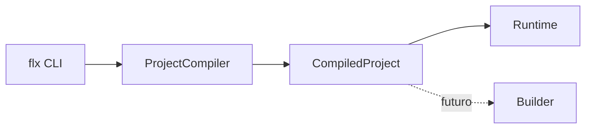
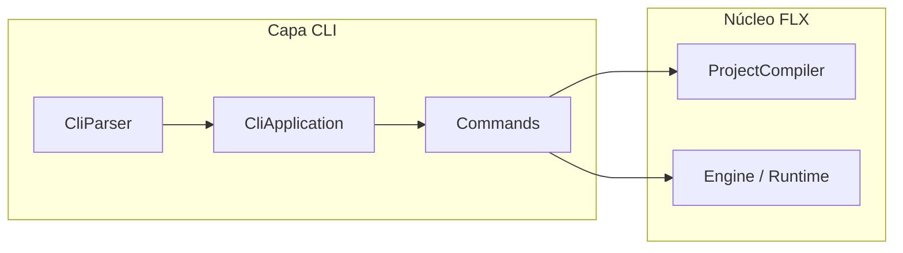
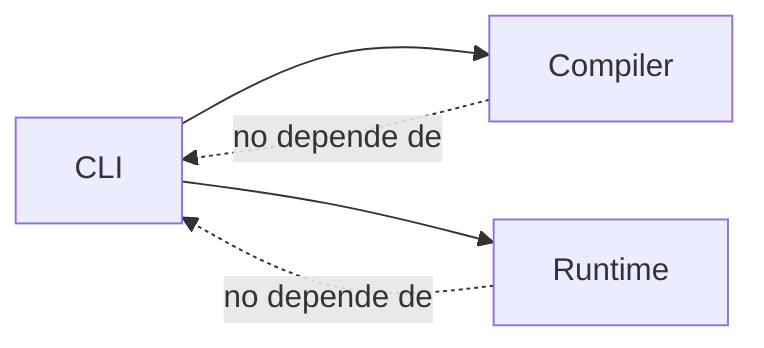
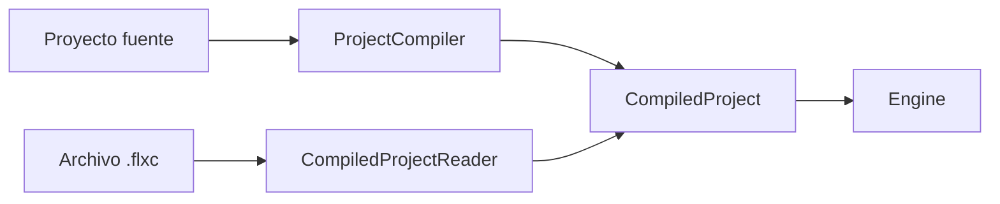
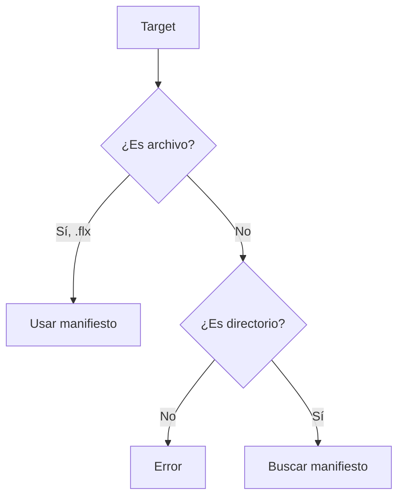

# Lenguaje visual de la especificación FLX

## 1. Propósito

Los diagramas de la especificación FLX sirven para representar visualmente:

- responsabilidades;
- dependencias;
- fronteras arquitectónicas;
- flujos de datos;
- secuencias;
- estados;
- ciclos de vida;
- caminos alternativos;
- productos generados.

Los diagramas complementan el texto normativo.

No lo sustituyen.

Si un diagrama y el texto normativo entran en contradicción, prevalece el texto normativo.

---

## 2. Formato

Los diagramas normativos DEBEN escribirse preferentemente mediante Mermaid dentro de los documentos Markdown.

Ejemplo:


Mermaid se utiliza porque:

- se almacena como texto;
- puede versionarse con Git;
- GitHub puede renderizarlo directamente;
- no exige almacenar imágenes binarias;
- permite revisar cambios mediante diff;
- mantiene el diagrama junto al texto que representa.

No deben utilizarse capturas de pantalla para representar arquitectura o comportamiento normativo.

Los diagramas externos, como PlantUML, C4-PlantUML o herramientas gráficas, solo deberían incorporarse cuando Mermaid no pueda expresar adecuadamente la información necesaria.

---

## 3. Autoridad normativa

El texto define el comportamiento obligatorio.

El diagrama ofrece una representación visual de ese comportamiento.

Un diagrama NO DEBE introducir:

- una capacidad no definida en el texto;
- una dependencia no documentada;
- una fase futura presentada como existente;
- una relación derivada únicamente de la implementación actual;
- una excepción no descrita.

Los elementos futuros deben marcarse explícitamente como tales.

---

## 4. Tipos de diagramas

Cada tipo de información debe representarse mediante el diagrama más apropiado.

### 4.1 Flujo

Utilizar `flowchart` para representar:

- transformación de datos;
- fases de una operación;
- rutas posibles;
- decisiones;
- productos de entrada y salida.

Ejemplo:



---

### 4.2 Dependencias

Utilizar `flowchart` para representar dependencias entre componentes conceptuales.

La flecha:

```text
A --> B
```

significa:

```text
A depende de B
```

Ejemplo:



Esto significa:

- el CLI puede utilizar Compiler;
- el CLI puede utilizar Runtime;
- Compiler y Runtime no dependen del CLI.

Las dependencias deben orientarse siempre en la dirección real de la dependencia.

No deben utilizarse flechas bidireccionales salvo que exista una dependencia mutua deliberada y documentada.

---

### 4.3 Secuencia

Utilizar `sequenceDiagram` cuando el orden temporal entre participantes sea importante.

Ejemplo:



Los diagramas de secuencia deben mostrar interacciones conceptuales.

No deberían reflejar llamadas privadas o detalles accidentales de una implementación concreta salvo que el documento describa precisamente dicha implementación.

---

### 4.4 Estados

Utilizar `stateDiagram-v2` para representar:

- estados de un objeto;
- estados de un proceso;
- transiciones;
- condiciones de entrada y salida;
- ciclo de vida.

Ejemplo:



Toda transición importante debe estar descrita también en el texto.

---

### 4.5 Estructuras

Utilizar `classDiagram` solo cuando sea necesario representar:

- estructuras conceptuales;
- composición;
- cardinalidad;
- contratos de datos.

Los diagramas de clases no deben utilizarse para fijar accidentalmente una implementación C++.

Por ejemplo, una estructura normativa puede expresar:



No debería incluir detalles como:

```text
std::unordered_map
std::shared_ptr
const char*
```

porque pertenecen a la implementación.

---

## 5. Niveles visuales

Los diagramas se clasifican en tres niveles.

### 5.1 Ecosistema

Representan sistemas o productos independientes.

Ejemplos:

- FLX CLI;
- Compiler;
- Runtime;
- Builder;
- aplicaciones externas consumidoras.

No deben mostrar clases C++.

---

### 5.2 Componente

Representan responsabilidades internas estables.

Ejemplos:

- CliParser;
- ProjectResolver;
- ProjectCompiler;
- ResourceRegistry;
- RuntimeWorld.

Pueden mostrar dependencias conceptuales, pero no detalles internos innecesarios.

---

### 5.3 Comportamiento

Representan una operación, secuencia o ciclo de vida concreto.

Ejemplos:

- resolución de un proyecto;
- ejecución desde fuentes;
- ejecución de `.flxc`;
- creación y muerte de un objeto;
- procesamiento de un frame.

Un mismo diagrama no debería mezclar los tres niveles si ello dificulta su lectura.

---

## 6. Elementos existentes y futuros

Los componentes existentes se representan con línea continua.

Los componentes previstos pero no implementados deben estar claramente marcados como futuros.

Ejemplo:



Una capacidad futura NO DEBE aparecer como parte normal del flujo actual.

---

## 7. Nombres

Los diagramas deben utilizar nombres conceptuales estables.

Ejemplos correctos:

```text
FLX CLI
ProjectCompiler
CompiledProject
ResourceRegistry
RuntimeWorld
```

No deberían utilizar nombres circunstanciales como:

```text
la clase nueva
loader viejo
esto
paso dos
módulo temporal
```

Cuando el nombre conceptual y el nombre de implementación sean distintos, debe preferirse el conceptual en la especificación.

---

## 8. Colores y estilos

Los diagramas deben ser comprensibles sin depender del color.

No deben utilizar el color como única forma de distinguir:

- éxito y error;
- presente y futuro;
- entrada y salida;
- dependencia permitida y prohibida.

La estructura, las etiquetas y el tipo de línea deben transmitir el significado principal.

Se evitará la personalización visual excesiva.

El objetivo es claridad, no decoración.

---

## 9. Dirección

Se utilizarán preferentemente estas direcciones:

```text
LR
```

para:

- dependencias;
- transformaciones;
- relaciones entre módulos.

```text
TD
```

para:

- ciclos de vida;
- fases largas;
- árboles;
- decisiones con múltiples caminos.

La dirección debe mantenerse coherente dentro del documento siempre que sea posible.

---

## 10. Fronteras

Las fronteras arquitectónicas pueden representarse mediante `subgraph`.

Ejemplo:



Una frontera debe representar una separación conceptual real.

No debe utilizarse únicamente para agrupar visualmente elementos próximos.

---

## 11. Dependencias prohibidas

Cuando sea importante mostrar una dependencia prohibida, debe indicarse expresamente en el texto.

El diagrama puede reforzarla mediante una flecha o anotación diferenciada.

Ejemplo conceptual:



No obstante, se prefiere representar las dependencias permitidas y declarar las prohibidas mediante texto normativo, para evitar diagramas visualmente confusos.

---

## 12. Caminos alternativos

Los caminos que convergen en una misma representación deben mostrarse explícitamente.

Ejemplo:



Este diagrama expresa que:

- ejecutar desde fuentes;
- ejecutar desde `.flxc`;

producen el mismo tipo de entrada para Engine.

---

## 13. Identificadores de reglas

Cuando un diagrama represente reglas normativas importantes, el texto asociado debería incluir identificadores estables.

Ejemplo:

```text
CLI-FLOW-001
Todos los comandos de ejecución desde fuentes DEBEN obtener un
CompiledProject mediante ProjectCompiler.
```

El diagrama puede incluir el identificador en su título o texto próximo, pero no es obligatorio introducirlo dentro del gráfico.

---

## 14. Relación con tests

Los diagramas no sustituyen a los tests.

Cuando un diagrama represente caminos diferentes, cada camino relevante debería estar respaldado por una prueba.

Ejemplo:



Deberían existir pruebas para:

- archivo `.flx`;
- archivo no `.flx`;
- directorio;
- ruta inexistente;
- directorio ambiguo.

---

## 15. Actualización

Cuando cambie un comportamiento representado por un diagrama, deben actualizarse conjuntamente:

1. el texto normativo;
2. el diagrama;
3. los tests relacionados;
4. la implementación.

Un diagrama desactualizado se considera un defecto de documentación.

---

## 16. Regla de simplicidad

Un diagrama debe responder a una pregunta concreta.

Si necesita explicar demasiadas cosas simultáneamente, debe dividirse.

Es preferible disponer de:

- un diagrama de dependencias;
- un diagrama de secuencia;
- un diagrama de estados;

que un único diagrama enorme que mezcle todos los conceptos.